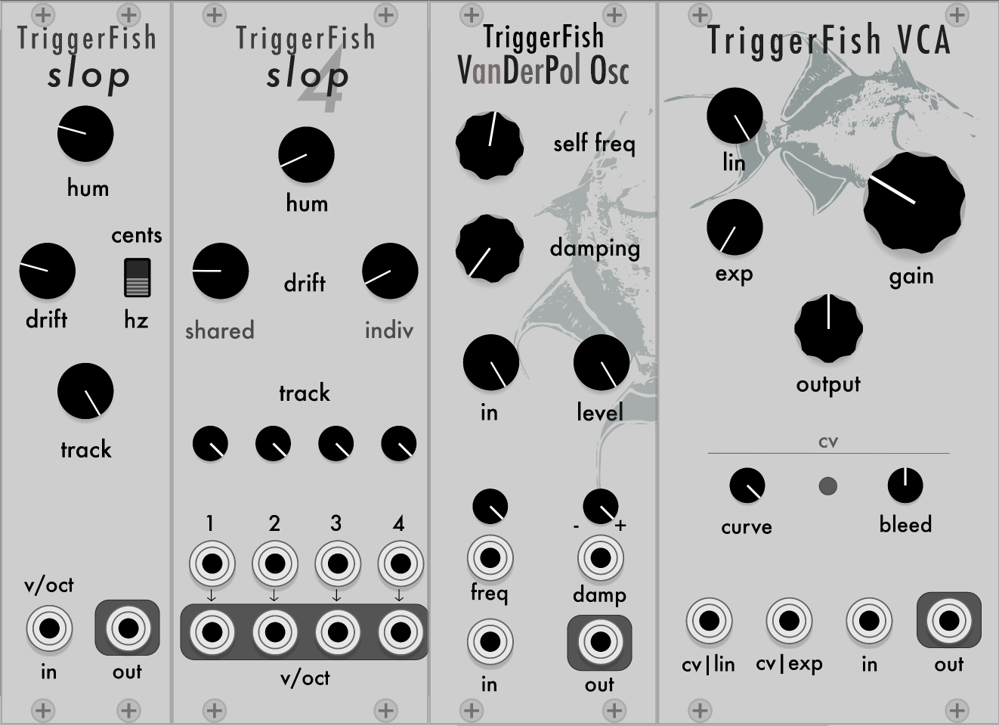

# TriggerFish Elements plugins

## Modules
- [Slop and Slop 4](slop-and-slop-4)
- [VDPO](vdpo)
- [VCA](vca)

### Slop and Slop 4
Slop and Slop4 are utilities to add drift and hum to V/oct signals in order to add pleasant detuning to VCOs.

Slop can add linear detuning ( Hz mode ) or proportional detuning ( cents mode ).

In Slop4, the common detuning is in cents ( i.e. proportional ) and the individual detunings are linear to give a more stable and pleasant beating accross octaves.

Hum adds 60hz frequency modulation to the V/Oct signals to replicate the power supply bleed and cross modulation in analog oscillators.

### VDPO
VDPO or Van Der Pol oscillator is based on the classic differential equation 

While it can self oscillate, best results are obtained by feeding it another oscillator at the input and playing with the self-freq, damping and input level to go from harmonic to inharmonic and chaotic.

**self-freq** controls the natural resonance frequency of the oscillator

**damping** controls the non linear damping of the oscillator. Note that it will affect the tuning as well as the harmonic and inharmonic content of the output waveform.

**in** controls the level of the (forcing) input which will force the oscillator to run at the same frequency as the input signal.

The higher the level the more the VDPO will follow the input, however if self-freq is too low the oscillator is too slow to follow it and all sorts of fun stuff happens.

Note that this modules solves a stiff differential equation in real time using backward differentiation and 4x oversampling and is thus quite CPU heavy despite using vectorized arithmetic.

## VCA
TriggerFish VCA is an analog modelled VCA that is loosely based on the minimoog's circuit.
Just like the original it includes 3 non linearities, one on the audio, one on the CV and one on the output.

The input non linearities are tanh-like but with a 1 pole feedback loop, resulting in some amount of slew limiting. The output nonlinearity is also a tanh but with no feedback loop, it also serves to limit the output to +-12v.

**Gain** controls the input gain, note that the output is level compensated to keep the volume approximately constant, so this control mostly affects the input saturation.
At very low levels more pink noise will be heard on the output, and with the knob fully counterclockwise the input will be cut out.

**lin** and **exp** are controls for the gain of the linear and exponential cv inputs. 
Exponential is more snappy but linear is typically better for normal enveloppe signals. Higher gains will result in more saturation and slew limiting of the CV.

For standard useage with enveloppes ADSR or AR enveloppes I recommend using the linear input.

**cv curve** controls the curve of the exponential input - higher is more exponential and snappier, lower is more linear.

**output** controls the output level, higher values will cause saturation as the level approach +-12v

**bleed** will send part of the input CV to the output to make it more clicky.

The model use antialiased integration for the nonlinearities and the whole module runs at 2x oversampling for low aliasing. 
Because of this the CPU useage is relatively high.

## Contributing

I welcome Issues and Pull Requests to this repository if you have suggestions for improvement.

