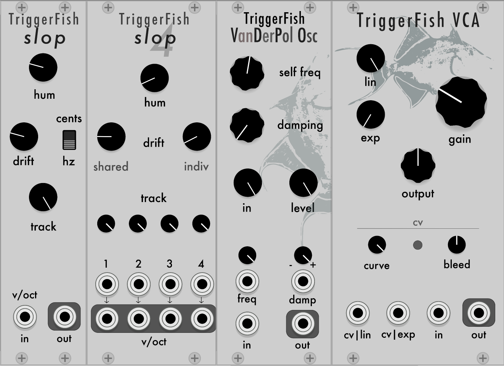
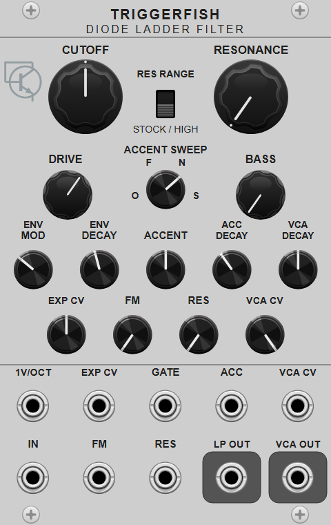

# TriggerFish Elements plugins

## Modules
- [Slop and Slop 4](#slop-and-slop-4)
- [VDPO](#vdpo)
- [VCA](#vca)
- [Diode Ladder Filter](#diode-ladder-filter)

### Slop and Slop 4
Slop and Slop4 are utilities to add drift and hum to V/oct signals in order to add pleasant detuning to VCOs.

Slop can add linear detuning ( Hz mode ) or proportional detuning ( cents mode ).

In Slop4, the common detuning is in cents ( i.e. proportional ) and the individual detunings are linear to give a more stable and pleasant beating accross octaves.

Hum adds 60hz frequency modulation to the V/Oct signals to replicate the power supply bleed and cross modulation in analog oscillators.

### VDPO
VDPO or Van Der Pol oscillator is based on the classic differential equation [wikipedia](http://en.wikipedia.org/wiki/Van_der_Pol_oscillator)

While it can self oscillate, best results are obtained by feeding it another oscillator at the input and playing with the self-freq, damping and input level to go from harmonic to inharmonic and chaotic.

**self-freq** controls the natural resonance frequency of the oscillator

**damping** controls the non linear damping of the oscillator. Note that it will affect the tuning as well as the harmonic and inharmonic content of the output waveform.

**in** controls the level of the (forcing) input which will force the oscillator to run at the same frequency as the input signal.

The higher the level the more the VDPO will follow the input, however if self-freq is too low the oscillator is too slow to follow it and all sorts of fun stuff happens.

The stiff differential equation is solved with a structure-aware, prewarped
split integrator and 4x oversampling. This improves pitch tracking across the
audio range while using adaptive work only for high damping at high frequency.

## VCA
TriggerFish VCA is an analog modelled VCA that is loosely based on the minimoog's circuit.
Just like the original it includes 3 non linearities, one on the audio, one on the CV and one on the output.

The input non linearities are tanh-like but with a 1 pole feedback loop, resulting in some amount of slew limiting. The output nonlinearity is also a tanh but with no feedback loop, it also serves to limit the output to +-12v.

**Drive** controls the level-compensated input drive. Its extended range mostly increases saturation and nonlinear slew rather than acting as another output-volume control.
At very low levels more pink noise will be heard on the output, and with the knob fully counterclockwise the input will be cut out.

**lin** and **exp** are controls for the gain of the linear and exponential cv inputs. 
Exponential is more snappy but linear is typically better for normal enveloppe signals. Higher gains will result in more saturation and slew limiting of the CV.

For standard useage with enveloppes ADSR or AR enveloppes I recommend using the linear input.

**cv curve** controls the curve of the exponential input - higher is more exponential and snappier, lower is more linear.

**output** controls the output level, higher values will cause saturation as the level approach +-12v

**bleed** will send part of the input CV to the output to make it more clicky.

The model use antialiased integration for the nonlinearities and the whole module runs at 2x oversampling for low aliasing. 
Because of this the CPU useage is relatively high.

## Diode Ladder Filter

TfDiodeLadderFilter is a circuit-modelled four-stage diode ladder inspired by
the Roland TB-303 filter. It combines the ladder with TB-303-style cutoff and
amplitude envelopes, accent handling, a BA662-style OTA VCA, and selected
Devil Fish-inspired extensions. `LP OUT` exposes the filter directly, while
`VCA OUT` provides a complete articulated voice.

**Cutoff** sets the base frequency from 10 Hz to 20 kHz. `1V/OCT` is a fixed,
calibrated tracking input and is not affected by the **EXP CV** knob. `EXP CV`
is a second exponential cutoff input with a bipolar attenuverter. At 100% it
also follows 1 V/octave; its 53.2% default lets a 0--10 V envelope sweep the
default 500 Hz cutoff to 20 kHz.

**FM** controls the bipolar amount of AC-coupled linear-frequency modulation.
It is intended for audio-rate filter FM and does not change the DC cutoff. At
100%, a +/-5 V signal contributes approximately +/-1 kHz.

**Resonance** sets the feedback level. The `RES` input has a bipolar
attenuverter, and **Res Range** selects Stock or High feedback. High mode
extends into self-oscillation at suitable cutoff settings. Resonance-dependent
makeup keeps the filtered signal at a useful level as feedback increases.

**Drive** controls the level entering the nonlinear ladder. The marked 0 dB
position is the stock calibration; the full range extends from mute to
+36.5 dB for stronger saturation and resonance interaction. **Bass** adds a
continuous low-frequency extension to the stock coupling response.

`GATE` drives the internal filter envelope and VCA envelope. A held gate does
not retrigger, allowing legato notes and pitch slides to retain the current
articulation. **Env Mod** sets the filter-envelope depth and **Env Decay** sets
its normal decay from 30 ms to 3 s.

`ACC` drives the accent path. **Accent** sets how strongly accents affect the
filter and VCA, while **Acc Decay** sets the accented filter-envelope decay
from 30 ms to 3 s. **Accent Sweep** selects Off, Fast, Normal, or Slow; Normal
is the stock default, with Fast and Slow providing Devil Fish-inspired
alternatives.

**VCA Decay** moves from short decay through longer decay and into sustain.
The `VCA CV` input is normalled to the internal volume envelope. Patching an
external 0--10 V signal replaces that envelope, and the **VCA CV** knob sets
its amount. Accent remains additive, so reducing **Accent** gives independent
external VCA control.

`IN` accepts the audio signal. `LP OUT` is the filter output before the
internal VCA. `VCA OUT` passes the same filtered signal through the
BA662-style VCA and its output coupling. The module is polyphonic: `IN` sets
the channel count, and monophonic control signals are shared across voices.

The module uses 4x oversampling by default. Right-click the panel to select 2x
oversampling for lower CPU use, or to switch the articulation timing between
TB-303 and Devil Fish modes.

The circuit analysis, equations, numerical method, calibration, references,
and validation results are in the
[TfDiodeLadderFilter technical report](docs/TfDiodeLadderFilter-technical-report.md).

## Contributing

Issues, pull requests and suggestions for improvement are all very welcome.

## Development

See [DEVELOPMENT.md](DEVELOPMENT.md) for the Windows toolchain and the
one-command build, test, package, install, and Rack workflows. The old
machine-specific Visual Studio/Python wrapper has been replaced by CMake,
pybind11, scikit-build-core, and uv.
