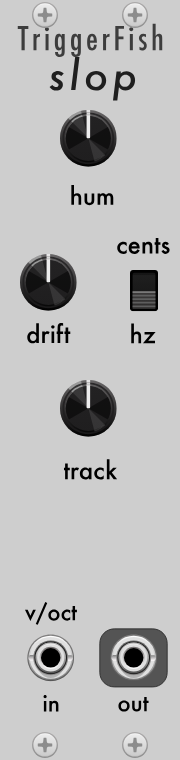
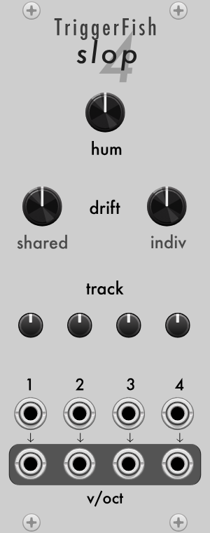
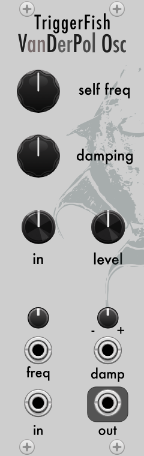
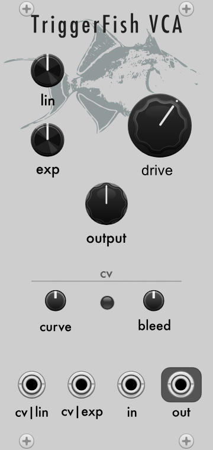
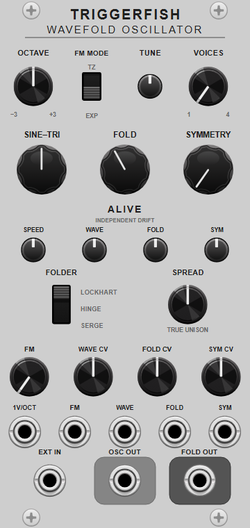
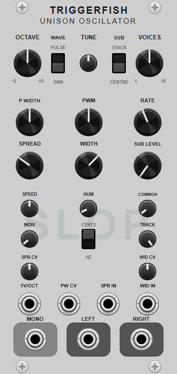
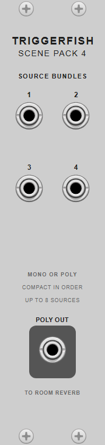

# TriggerFish Elements

Circuit-modelled sound generators and processors, plus pitch utilities for VCV Rack 2.

[Release notes for 2.3.1](docs/releases/2.3.1.md)

<table>
  <tr>
    <td align="center"><a href="#slop-and-slop-4"> <strong>Slop</strong></a></td>
    <td align="center"><a href="#slop-and-slop-4"> <strong>Slop 4</strong></a></td>
    <td align="center"><a href="#vdpo"> <strong>VDPO</strong></a></td>
  </tr>
  <tr>
    <td align="center"><a href="#vca"> <strong>VCA</strong></a></td>
    <td align="center"><a href="#303-oscillator"> <strong>303 Oscillator</strong></a></td>
    <td align="center"><a href="#303-voice-core"> <strong>303 Voice Core</strong></a></td>
  </tr>
  <tr>
    <td align="center"><a href="#4072-voice-core"> <strong>4072 Voice Core</strong></a></td>
    <td align="center"><a href="#wavefold-oscillator"> <strong>Wavefold Oscillator</strong></a></td>
    <td align="center"><a href="#unison-oscillator"> <strong>Unison Oscillator</strong></a></td>
  </tr>
  <tr>
    <td align="center"><a href="#scene-pack-4"> <strong>Scene Pack 4</strong></a></td>
  </tr>
</table>

## Polyphony

| Module | Handling | Output voice count |
| --- | --- | --- |
| Slop | Monophonic; reads channel 1 of `1V/OCT` | One |
| Slop 4 | Four independent monophonic signal paths | One per output jack |
| VDPO | Monophonic; reads channel 1 of each input | One |
| VCA | Monophonic; reads channel 1 of each input | One |
| 303 Oscillator | Fully polyphonic, with independent DSP state per voice; mono inputs are broadcast | Widest connected input, up to 16 |
| 303 Voice Core | Fully polyphonic, with independent filter, envelope, accent, and VCA state; mono controls are broadcast | Channel count of `IN`, up to 16 |
| 4072 Voice Core | Fully polyphonic, with independent filter, dual-envelope, and VCA state; mono controls are broadcast | Widest connected input, up to 16 |
| Wavefold Oscillator | Fully polyphonic, with independent oscillator, folder, and resampling state; mono controls are broadcast | Widest connected input, up to 16 |
| Unison Oscillator | Fully polyphonic, with an independent oscillator stack and drift state per channel; mono controls are broadcast | Widest connected input, up to 16 |
| Scene Pack 4 | Compacts four connected mono sources and appends an optional incoming scene bus | Matching AUDIO/X/Y/Z outputs, up to 8 channels |

## Modules

### Slop and Slop 4

Slop adds slow pitch drift and 60 Hz power-supply hum to a 1 V/octave signal.
The drift can be proportional, measured in cents, or linear, measured in hertz.
The tracking control also allows small oscillator-tracking errors to be modelled.

Slop 4 applies shared proportional drift and hum to four independent monophonic
paths, then adds a separate linear drift to each voice. This produces coherent
ensemble motion with stable beating across the keyboard. Each path has its own
tracking trim.

### VDPO

VDPO is a driven [Van der Pol oscillator](https://en.wikipedia.org/wiki/Van_der_Pol_oscillator).
It can self-oscillate, or lock imperfectly to a signal patched into `IN`, moving
from harmonic locking through inharmonic and chaotic responses.

- **Self freq** sets the oscillator's natural frequency.
- **Damping** sets the nonlinear damping and therefore affects both tuning and
  waveform complexity.
- **In** controls the forcing-signal level.
- **Damp** accepts bipolar damping modulation.

The stiff differential equation is evaluated by a structure-aware, prewarped
split integrator at 4x sample rate. Adaptive work is confined to the demanding
high-frequency, high-damping region. Audio, pitch, and damping controls are
reconstructed at 4x; pitch is converted to frequency inside that path.

### VCA

VCA is a transistor-inspired amplifier with separate nonlinear audio and control
paths, followed by a saturating output stage. The nonlinear amplifier core runs
at 2x sample rate. Linear and exponential CV are reconstructed separately before
the exponential control law and limiting are applied. CV bleed follows the
reconstructed control; final DC rejection runs at Rack's sample rate.

- **Drive** increases input saturation while compensating most of the associated
  level change.
- **Lin** and **Exp** set the depth of the two 0–10 V control inputs. Both default
  to 100%.
- **Curve** changes the exponential CV response, while **Bleed** adds a small,
  high-passed control transient to the output.
- **Output** sets the final level and the amount driven into the output stage.

For conventional AR and ADSR envelopes, the linear input is usually the most
predictable starting point.

### 303 Oscillator

303 Oscillator combines a band-limited saw core with a circuit-modelled TB-303
Q8 saw-to-square shaper. The module supports polyphony,
voltage-controlled waveform morphing, hard sync, extended tuning, and two FM
responses.

- **Octave** selects an integer offset from −3 to +3 octaves; **Tune** covers
  ±7 semitones.
- `1V/OCT` is the pitch input. `SLIDE` enables the internal pitch glide while
  high, and **SL.Time** sets its nominal duration from 2 to 360 ms.
- **Shape** shifts the square-wave switching point. **Wave** morphs continuously
  from saw to square with consistent level through the midpoint.
- `FM` is exponential in **EXP** mode and signed linear through-zero FM in **TZ**
  mode. The attenuverter sets depth in either mode.
- `SYNC` performs fractionally timed, minBLEP-corrected hard sync.
- `CV OUT` exposes the post-slide pitch signal for driving another oscillator or
  filter; `OUT` is the audio output.

The widest connected input sets the output channel count. Each voice has its own
oscillator, shaper, slide, sync, and resampling state; mono modulation inputs are
shared across the active voices.

The oscillator uses 4x oversampling by default. A 2x mode is available from the
context menu for dense polyphonic patches where CPU use matters more than the
extra alias suppression at high pitch or under complex FM and sync.
The [303 Oscillator technical report](docs/Tf303Oscillator-technical-report.md)
describes the model and its antialiasing in detail.

### Wavefold Oscillator

Wavefold Oscillator combines a band-limited sine/triangle oscillator with three
selectable folding characters. **Hinge** is a smooth four-stage design;
**Lockhart** and **Serge** follow the circuit models analysed by
[Esqueda et al.](https://doi.org/10.3390/app7121328). Lockhart is the brighter,
more harmonically active response, while Serge has a smoother, darker contour.

- **Octave** selects −3 to +3 octaves and **Tune** covers ±7 semitones.
- **Sine–Tri** morphs the source waveform. **Fold** controls input drive through
  the selected cascade, and **Symmetry** offsets its operating point.
- `WAVE`, `FOLD`, and `SYM` each have a bipolar CV attenuverter. FM can use
  exponential or signed through-zero response.
- **Alive Speed** sets a common 0.5–120 s mean-reversion time for three
  independent drift processes. The **Wave**, **Fold**, and **Sym** trimmers set
  their individual excursions; all three depths default to 50%.
- **Voices** selects one to four true-unison oscillator voices. **Spread** sets
  outer-voice offsets up to ±50 cents while preserving the centre pitch.
- `OSC OUT` provides the source before folding. Patching a nominal ±5 V signal
  into `EXT IN` replaces the internal oscillator at the folder input;
  `FOLD OUT` provides the processed signal.

The nonlinear path runs at 4x sample rate by default. The internal oscillator
gradually reduces extreme fold depth at high notes to keep its harmonic density
musically useful. External signals retain the requested fold depth. A 2x mode
is available from the context menu. Each polyphonic voice has independent
oscillator, folder, resampling, and Alive drift state.

### Unison Oscillator

Unison Oscillator builds a normalized stack of one to sixteen band-limited saw
or pulse voices for each polyphonic input channel. Voice-count changes fade and
reposition the stack smoothly, avoiding abrupt level and stereo jumps.

- **Octave** selects −3 to +3 octaves, **Tune** covers ±7 semitones, and
  **Voices** selects the stack size from one to sixteen.
- **Wave** selects saw or pulse. **P Width** sets pulse width from 5% to 95%; the
  bipolar **PWM** amount uses `PW CV` when patched, or the internal
  0.03–10 Hz **Rate** oscillator when unpatched.
- **Spread** distributes voices with outer offsets up to ±50 cents. **Width**
  distributes the stack across the stereo outputs. Both have bipolar CV
  attenuverters.
- **Sub Level** mixes a pulse sub-oscillator one octave down into all outputs.
  **Centre** uses one oscillator at the central pitch; **Stack** gives every
  unison voice its own detuned and panned sub.
- The built-in Slop section adds common 60 Hz hum, common proportional drift,
  individual drift in cents or hertz, and per-voice tracking error. **Speed**
  sets the drift time from 0.5 to 120 seconds.
- `MONO` is the normalized stack mix. `LEFT` and `RIGHT` use equal-power
  panning and match the mono level when **Width** is zero.

The widest connected input sets the output channel count, up to 16. Each Rack
channel owns an independent one-to-sixteen-voice oscillator stack and
individual drift processes; common drift and hum are shared across channels.

### 303 Voice Core

303 Voice Core is a circuit-modelled TB-303 voice back end. It includes the
four-stage diode ladder, coupling and resonance networks, filter and volume
envelopes, accent path, and BA662-style OTA VCA. `LP OUT` exposes the filter directly;
`VCA OUT` provides the complete articulated signal.

- **Cutoff** spans 10 Hz to 20 kHz. `1V/OCT` tracks directly, while `EXP CV`
  provides a second exponential input with an attenuverter.
- **FM** applies bipolar, AC-coupled linear cutoff modulation. **Res** modulates
  resonance, and **Res Range** selects the stock or extended feedback range.
- **Drive** sets the level entering the nonlinear ladder. **Bass** continuously
  restores low-frequency response lost in the original coupling network.
- `GATE` drives the internal filter and volume envelopes. `ACC` adds the accent
  response. The five envelope controls set filter depth, normal and accented
  decay, accent amount, and VCA decay/sustain.
- **Accent Sweep** provides Off, Fast, Normal, and Slow responses. Normal is the
  stock setting; Fast and Slow extend the timing in the spirit of Devil Fish.
- Patching `VCA CV` replaces the internal volume envelope. Its attenuator controls
  the external 0–10 V signal, while accent remains additive.

> **Level warning:** Bass is an extended boost control. With high resonance,
> large Bass settings can exceed Rack's nominal audio range and clip downstream
> modules. Reduce Bass, Drive, or mixer gain if this occurs.

The `IN` cable sets the filter's polyphonic voice count. Each audio channel has
independent filter, envelope, accent, and VCA state; mono control inputs are
shared across those voices.

The filter uses 4x oversampling by default, with a 2x context-menu option. The
context menu also selects stock or Devil Fish volume-envelope timing. Circuit
analysis, equations, calibration, and numerical validation are collected in the
[303 Voice Core technical report](docs/Tf303VoiceCore-technical-report.md).

### 4072 Voice Core

4072 Voice Core combines a circuit-modelled ARP 4072 four-pole low-pass filter,
two switchable AR/AD/ADSR envelope generators, and an ARP 4019-style discrete
VCA.
The filter's outer differential pair preserves the original unequal audio and
resonance-return levels, while the four locally fed-back filter stages operate
around their circuit bias points.

- **Cutoff** and `F 1V/OCT` set the filter frequency. The internal filter
  envelope uses the original exponential cutoff law through `ENV>CUT`.
- **Input** covers attenuation through +24 dB of filter drive. The cutoff
  control extends to 20 kHz using ARP's published correction for the original
  4072 high-frequency limitation.
- The two A/D/S/R slider rows generate 0–10 V envelopes. Each row can be switched
  among AR, AD, and ADSR. The playable default uses AD for both envelopes, with
  minimum Attack and one-second Decay: a bright, gate-length-independent
  starting point derived from the [ARP patch book's](https://www.korg.com/us/support/download/manual/0/877/4471/)
  plucked-instrument settings. Sustain is inactive in AD, but defaults to 50%
  for the filter and 100% for the amplifier so selecting ADSR gives an immediate
  sustained sound. Release defaults to one second for AR and ADSR operation.
  **Curve** varies both envelope shapes around the original circuit response.
- The amplifier envelope's `LIN / EXP` switch selects the 4019 VCA response for
  all three envelope modes. It defaults to EXP for the sharper 10 dB/V contour
  used by classic plucked patches.
- `CUT MOD` and `VCA MOD` each have one input, one amount control, and a
  `LIN / EXP` switch. Filter LIN is signed 200 Hz/V frequency modulation;
  filter EXP is 1 V/oct at 100%. VCA LIN follows the 4019 linear-gain input,
  while VCA EXP follows its 10 dB/V control law.
- The adjacent `+ / EXT` switches add each external modulation signal to its
  internal envelope or replace that envelope. An unpatched modulation input
  keeps the internal envelope active in either position. Both default to `+`.
- `VCA IN` replaces the normalled filter-to-VCA audio connection. `LP OUT`,
  `VCA OUT`, and both envelope outputs expose each stage independently.

#### Envelope modes

- **AR** attacks when Gate rises, holds its peak while Gate remains high, and
  releases when Gate falls. It is useful for straightforward note-length
  articulation, sustained sounds, and gate-following filter movement. AR uses
  the Board-4 response and ignores Trigger.
- **AD** is a retriggerable Attack–Decay one-shot independent of Gate length.
  It is useful for plucks, percussion, sequencer steps, and repeatable filter
  sweeps.
- **ADSR** attacks, decays to Sustain, holds while Gate remains high, and then
  releases. It is useful for keyboard articulation and sweeps with distinct
  peak and held levels. At maximum Sustain it can reproduce an AR level
  sequence; AR retains its different attack curve and Gate-only triggering.

The amplifier envelope law is independent of these modes. LIN gives direct
0–10 V gain control; EXP applies the original 10 dB/V VCA response for sharper
attack, decay, and sustain contours.

The original 2600 normally routes ADSR to filter cutoff. Its VCA receives AR
through the linear control input and ADSR through the exponential input. Its
plucked patches obtain an AD-like contour from ADSR with Sustain at zero. The
module's dedicated AD mode gives this contour timing independent of gate
length; select AR and LIN for the original gate-following AR path.

The complete filter/VCA path runs at 4x sample rate by default. A 2x mode is
available from the context menu for larger polyphonic patches.
Circuit analysis, equations, calibration, and numerical validation are in the
[4072 Voice Core technical report](docs/Tf4072VoiceCore-technical-report.md).

### Scene Pack 4

Scene Pack 4 prepares positioned sources for the forthcoming TfReverb. Patch up
to four mono sources and set an X, Y, and Z position for each. The four outputs
carry aligned polyphonic AUDIO/X/Y/Z channels; 0–10 V on a position cable maps
across the corresponding room axis.

The optional scene-bus inputs append already-packed channels before the local
sources. Chaining two modules supports the reverb's maximum of eight independent
sources. Connected local inputs are compacted into consecutive channels, and a
polyphonic signal patched into one local input is summed into that lane's single
positioned source.

## Contributing

Issues, pull requests, and suggestions are welcome.

## Development

See [DEVELOPMENT.md](DEVELOPMENT.md) for Windows and Linux setup and the build,
test, package, install, panel-rendering, and Rack workflows.
