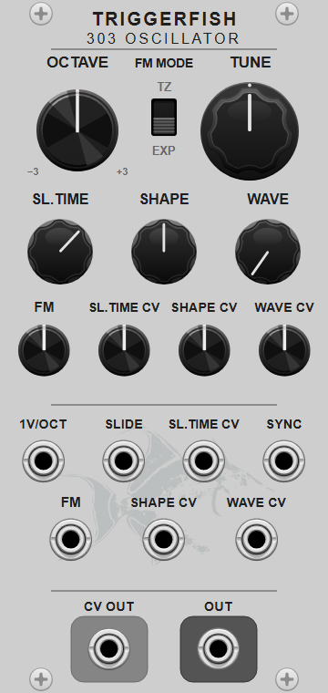
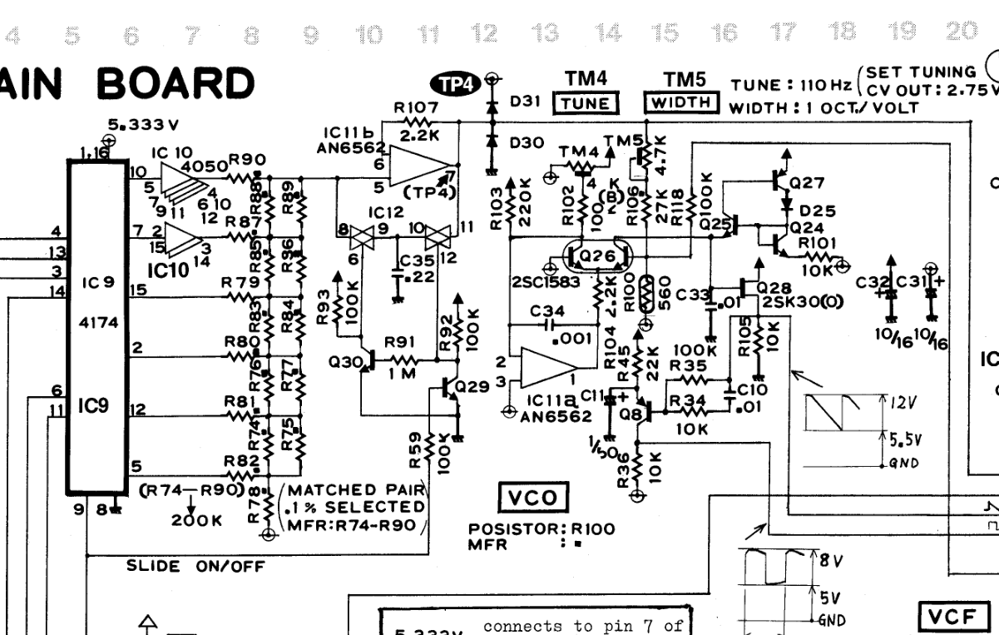

# 303 Oscillator technical report

The [module guide](../README.md#303-oscillator) describes the controls and
patching interface.

## 1. Module architecture

303 Oscillator models the pitch, slide, saw oscillator, and transistor square
shaper of the Roland TB-303. The signal path is:

$$
\text{pitch CV} \longrightarrow \text{slide} \longrightarrow
\text{phase oscillator} \longrightarrow
\begin{cases}
\text{saw}\\
\text{square shaper}
\end{cases}
\longrightarrow \text{wave mix}.
$$

The model preserves the original 1 V/octave response and slide curve. At the
stock 60 ms setting, pitch approaches its target exponentially and completes
about 93.5% of the transition in that time. It also preserves the saw-to-square
level difference and the square wave's pitch-dependent duty and edge shape.
Octave and fine tuning, continuous waveform morphing, Shape modulation,
exponential or through-zero linear FM, sub-sample-accurate hard sync, and Rack
polyphony extend that circuit for modular use.

The audio path runs at four times the Rack sample rate by default. A two-times
mode is available from the context menu.

### Voltage and control mapping

The saw is centred around 0 V. The square is centred near 0 V at its nominal
operating point; changing its pulse width changes the relative time spent at
the high and low levels and therefore changes its mean voltage. Both occupy the
usual Rack audio range of approximately 10 V peak-to-peak. Pitch uses Rack's
1 V/octave convention. Slide and Sync enter their high state above 1 V and
return low below 0.1 V.

Each connected input can be polyphonic. The greatest input channel count sets
the output channel count, and mono inputs are broadcast to every voice.

## 2. Circuit analysis

### 2.1 Pitch, slide, and saw oscillator

<em>Figure 1. Pitch, slide, and VCO section of the TB-303
main board. IC9–IC12 select and hold the note CV; Q29/Q30 and C35 form the
slide path; IC11b, Q26, and the following transistor network form the
saw oscillator. Source: Roland TB-303 Service Notes, main-board schematic.</em>

The sequencer's resistor ladder generates the note voltage. With Slide off,
the switching circuit transfers the new voltage directly to the VCO control
node. With Slide on, C35 charges through R92, producing a first-order glide.
The RC network has a time constant of approximately 22 ms: pitch reaches 63.2%
of a step after 22 ms and about 93.5% after the stock 60 ms slide duration.

The oscillator integrates a control current until its reset network switches,
giving the rising ramp shown beside Q28 in Figure 1. The service notes specify
5.5 V for the saw excursion. The waveform switch routes this ramp directly or
routes the signal shaped by Q8.

### 2.2 Q8 square shaper

Q8 is a common-emitter PNP transistor used as the saw-to-square converter. R35
feeds the saw to its base through 100 kΩ. A second path through C10 and R34 adds
progressively more base drive as frequency rises. With $s$ denoting complex
frequency, the impedance of this second path is

$$
Z_{mathrm{AC}}(s)=10\,\mathrm{k}\Omega+\frac{1}{s\,10\,\mathrm{nF}}.
$$

R45 supplies the emitter from 12 V through 22 kΩ, while C11 bypasses that node
to ground with 1 µF. R36 returns the collector to the 5.333 V reference through
10 kΩ. The square waveform is taken from the collector.

At first order, Q8 is an inverting threshold stage. When its base is sufficiently
below its emitter, the PNP transistor conducts and raises the collector above
the 5.333 V reference by driving current through R36. When Q8 cuts off, R36
returns the collector toward 5.333 V. The threshold position within the saw
excursion therefore determines how long the collector remains in each state. A
fixed threshold applied to a fixed-amplitude linear ramp would give a fixed duty
cycle.

The C10/R34 path raises the base drive at higher pitches, so the crossing point
moves through the saw excursion as its period changes. C11 adds slower emitter
bias motion. The transistor moves between cutoff, forward-active operation,
and saturation, giving unequal edges and a drooping pulse top. Pitch therefore
changes duty cycle and edge shape as well as repetition rate.

Measurements of an original unit place equal duty near 85 Hz. At lower
frequencies the collector-high interval is broader; at higher frequencies it
is narrower. Those measurements, together with the component values in Figure
1, determine the operating-point and waveform checks used for the Q8 model.

## 3. DSP implementation

### 3.1 Oversampled signal path

Rack supplies one value per host sample for Pitch, Slide Time, FM, Shape, and
Wave. A seventh-order polyphase infinite-impulse-response (IIR) interpolator
reconstructs each control at two or four times that rate. Pitch is converted
from octaves to hertz after interpolation, so audio-rate pitch modulation
follows the reconstructed control with a smooth trajectory between host
samples.

The phase oscillator, hard-sync correction, Q8 circuit, and waveform mix all
run at this internal rate. Matching seventh-order decimators remove frequencies
above the Rack Nyquist limit before returning the saw, square, and mixed signals
to the host rate.

At the internal rate, the output-headroom function is linear through ±10.5 V
and approaches ±11.5 V smoothly under overload. After decimation, a second
smooth stage limits any decimation-filter overshoot below ±11.7 V. Normal
oscillator levels remain in the linear region of both stages.

### 3.2 Pitch and slide

Let $p_t$ be the incoming pitch in octaves relative to C4 and $p_s$ the slide
state. While Slide is high,

$$
p_s[n+1]=p_s[n]+\alpha_s\bigl(p_t[n]-p_s[n]\bigr),
$$

$$
\alpha_s=-\operatorname{expm1}
\left(-\frac{1}{f_i\tau_s}\right),
$$

$$
\tau_s=T_{\mathrm{slide}}\frac{22}{60},
$$

where $f_i$ is the internal sample rate and $T_{\mathrm{slide}}$ is the time
shown by the Slide Time control. The factor $22/60$ converts that displayed
transition duration to the hardware's 22 ms RC time constant at the 60 ms stock
setting. With Slide low, $p_s$ follows $p_t$ immediately. CV OUT exposes $p_s$
before the Octave and Tune offsets.

$\operatorname{expm1}(z)=e^z-1$ is evaluated directly by the math library to
retain numerical precision when $z$ is close to zero.

In the frequency equations below, $p_{\mathrm{oct}}$ and $p_{\mathrm{tune}}$
are the panel offsets in octaves, $a_{\mathrm{FM}}$ is the bipolar FM attenuator
in $[-1,1]$, and $v_{\mathrm{FM}}$ is the FM input in volts.

In exponential FM mode,

$$
f=261.625565\,
2^{p_s+p_{\mathrm{oct}}+p_{\mathrm{tune}}+
0.2a_{\mathrm{FM}}v_{\mathrm{FM}}}.
$$

At full positive depth, a +5 V input raises the oscillator by one octave and a
−5 V input lowers it by one octave.

Through-zero mode adds FM in hertz:

$$
f=261.625565\,2^{p_s+p_{\mathrm{oct}}+p_{\mathrm{tune}}}
+200a_{\mathrm{FM}}v_{\mathrm{FM}}.
$$

At full positive depth, +5 V adds 1 kHz and −5 V subtracts 1 kHz. A negative
result reverses phase motion. Frequencies up to $0.40f_h$ are used directly,
where $f_h$ is the Rack sample rate. Above that knee, the magnitude approaches
$0.45f_h$ smoothly:

$$
f_{\mathrm{limited}}=\operatorname{sgn}(f)\left[
0.40f_h+0.05f_h\tanh\left(
\frac{|f|-0.40f_h}{0.05f_h}\right)\right].
$$

This keeps the phase increment below the discrete-time limit while preserving
the sign required for through-zero operation.

### 3.3 Saw generation and hard sync

The phase increment for one internal sample is

$$
\Delta\phi=\frac{f}{f_i}.
$$

With positive phase motion, each saw period ends with a discontinuous jump from
+1 to −1; negative phase motion reverses that jump. A band-limited step
correction, or BLEP, replaces the aliased instantaneous jump with a short
band-limited transition. Ordinary phase wraps use the inexpensive polynomial
form, commonly called polyBLEP.

#### Sync edge timing

Sync is detected at the Rack sample rate by a Schmitt trigger. It enters its
high state when the input crosses 1 V and remains high until the input falls
below 0.1 V. This hysteresis prevents noise near the threshold from producing
several resets.

Let $v_{n-1}$ and $v_n$ be consecutive Sync samples containing a rising
crossing. Linear interpolation estimates the crossing position $t$ within the
Rack sample:

$$
t=\operatorname{clamp}
\left(\frac{1-v_{n-1}}{v_n-v_{n-1}},0,1\right).
$$

For oversampling factor $M$, the event belongs to internal segment

$$
m=\min\left(\lfloor Mt\rfloor,M-1\right)
$$

at fractional position

$$
\rho=Mt-m.
$$

This combination of Schmitt hysteresis and sub-sample crossing estimation is
implemented by the reusable fractional Schmitt-trigger component. It avoids
quantizing every reset to a Rack sample or to the beginning of an oversampled
segment.

For each detected hard-sync edge, the oscillator:

1. advances to the crossing;
2. measures the saw discontinuity;
3. resets phase to 0 for positive motion or to 1 for negative motion;
4. advances through the remainder of the internal segment; and
5. inserts a minBLEP with the measured amplitude and fractional position.

Hard sync can reset the saw from any phase, so its discontinuity has a variable
height and an arbitrary sub-sample position. The minimum-phase BLEP, or
minBLEP, is an eight-zero-crossing Blackman–Harris-windowed sinc transformed to
minimum phase by cepstral reconstruction. A 32-times table grid resolves
fractional positions, and each correction lasts 16 internal samples.

### 3.4 Q8 circuit model

The digital model evaluates the R34/R35/C10 base network, the R45/C11 emitter
network, and Q8 at every oversampled time step. Let $x\in[-1,1]$ be the digital
saw and let $a_{\mathrm{shape}}\in[-1,1]$ be the Shape control. They set the
voltage applied to the two base-drive paths:

$$
V_s=8.5-2.75x-3a_{\mathrm{shape}}.
$$

The 8.5 V centre and 2.75 V half-range reproduce the measured 5.5 Vpp hardware
saw. The minus sign follows the polarity of the physical saw at Q8. The
$3a_{\mathrm{shape}}$ term is the module's extended bias control; it shifts
Q8's base drive and therefore changes pulse width.

#### Capacitor companion networks

Both capacitors use the trapezoidal rule. At one time step, this represents a
capacitor by a resistance or conductance plus a history term obtained from its
stored voltage and current. Let $h=1/f_i$ be one internal sample period. For
C10, define

$$
R_{C10}=\frac{h}{2C_{10}},
$$

$$
H_{C10}=V_{C10}[n-1]+R_{C10}I_{C10}[n-1].
$$

The R35 path and the series C10/R34 path reduce to a Thevenin equivalent: one
voltage source $V_{b0}$ in series with one resistance $R_b$ at Q8's base:

$$
R_b=\left(\frac{1}{R_{35}}+
\frac{1}{R_{34}+R_{C10}}\right)^{-1},
$$

$$
V_{b0}=R_b\left(\frac{V_s}{R_{35}}+
\frac{V_s-H_{C10}}{R_{34}+R_{C10}}\right).
$$

For C11, define

$$
G_{C11}=\frac{2C_{11}}{h},
$$

$$
H_{C11}=-I_{C11}[n-1]-G_{C11}V_e[n-1].
$$

The emitter network becomes

$$
R_e=\left(\frac{1}{R_{45}}+G_{C11}\right)^{-1},
$$

$$
V_{e0}=R_e\left(\frac{12}{R_{45}}-H_{C11}\right).
$$

For these equations, $V_{C10}$ is measured from the saw side of C10 toward R34,
and $I_{C10}$ is positive in the same direction. $I_{C11}$ is positive from the
emitter node toward ground. Their stored states are updated after the transistor
solve, as shown below.

#### Ebers–Moll transistor equations

Q8 enters saturation during part of the waveform, so both its emitter-base and
collector-base junctions participate. The Ebers–Moll equations represent these
junction voltages in thermal-voltage units:

$$
u_F=\frac{V_e-V_b}{V_T}, \qquad
u_R=\frac{V_c-V_b}{V_T}.
$$

Here $V_e$, $V_b$, and $V_c$ are the emitter, base, and collector voltages, and
$V_T$ is the thermal voltage. The nominal transistor parameters are:

| Parameter | Value |
| --- | ---: |
| $I_S$ | $4.0\times10^{-14}$ A |
| $\beta_F$ | 300 |
| $\beta_R$ | 10 |
| $V_T$ at 27 °C | 25.85 mV |

$I_S$ follows from the specified 0.62 V base-emitter operating point at 1 mA,
and $\beta_F=300$ is the centre of the 2SA733 P-rank interval of 200–400.
$\beta_R=10$ is the reverse-gain proxy used by the ngspice reference to set the
saturation region. The real-time model and reference both use 27 °C for the
nominal comparison.

With $\alpha_F=\beta_F/(\beta_F+1)$ and
$\alpha_R=\beta_R/(\beta_R+1)$, the reverse saturation current is

$$
I_{SR}=\frac{\alpha_F}{\alpha_R}I_S.
$$

This is the Ebers–Moll reciprocity relation between the forward and reverse
transport currents. The two junction currents are therefore

$$
I_F=I_S\left(e^{u_F}-1\right), \qquad
I_R=I_{SR}\left(e^{u_R}-1\right).
$$

The emitter, collector, and base currents are

$$
I_e=I_F-\alpha_R I_R,
$$

$$
I_c=\alpha_F I_F-I_R,
$$

$$
I_b=(1-\alpha_F)I_F+(1-\alpha_R)I_R.
$$

$I_e$ is positive from the emitter node into Q8. $I_c$ and $I_b$ are positive
from Q8 into the collector and base networks. With these directions, the
Thevenin networks derived above give the three terminal voltages:

$$
V_b=V_{b0}+R_bI_b,
$$

$$
V_e=V_{e0}-R_eI_e,
$$

$$
V_c=5.333+R_{36}I_c.
$$

These equations cover cutoff, forward-active operation, and saturation. In
saturation both junction exponentials contribute to the unequal edges and
high-frequency harmonic structure.

#### Implicit solve

The transistor currents determine $V_b$, $V_e$, and $V_c$, while those same
voltages determine the transistor currents. The solution is the pair
$(u_F,u_R)$ for which both consistency errors, or residuals, are zero:

$$
r_F=u_F-\frac{V_e-V_b}{V_T}, \qquad
r_R=u_R-\frac{V_c-V_b}{V_T}.
$$

The exponential derivatives are $I'_F=I_S e^{u_F}$ and
$I'_R=I_{SR}e^{u_R}$. They give the terminal-current derivatives directly;
for example,

$$
\frac{\partial I_e}{\partial u_F}=I'_F, \qquad
\frac{\partial I_e}{\partial u_R}=-\alpha_R I'_R.
$$

For compactness, let $I_{e,F}=\partial I_e/\partial u_F$ and use the same
subscript convention for the other terminal currents and for $u_R$. The
analytic Jacobian of $(r_F,r_R)$ is

$$
J_{00}=1+\frac{R_e I_{e,F}+R_b I_{b,F}}{V_T},
$$

$$
J_{01}=\frac{R_e I_{e,R}+R_b I_{b,R}}{V_T},
$$

$$
J_{10}=-\frac{R_{36} I_{c,F}-R_b I_{b,F}}{V_T},
$$

$$
J_{11}=1-\frac{R_{36} I_{c,R}-R_b I_{b,R}}{V_T}.
$$

One two-variable Newton solve is performed per oversampled sample. Each
iteration solves

$$
J\Delta=r,
$$

$$
\begin{bmatrix}u_F\\u_R\end{bmatrix}_{k+1}=
\begin{bmatrix}u_F\\u_R\end{bmatrix}_{k}-\lambda\Delta.
$$

The converged $(u_F,u_R)$ from the preceding sample supplies the initial
estimate. The damping factor

$$
\lambda=\left[
\max\left(1,\frac{|\Delta_F|}{2},\frac{|\Delta_R|}{2}\right)
\right]^{-1}
$$

limits the magnitude of either dimensionless junction-voltage update to 2.
The solve uses at most eight iterations and stops when both updates are below
$10^{-4}$. A fifth-order base-2 exponential approximation evaluates the
junction currents with a maximum relative error of about $6\times10^{-6}$ over
the solver's input range. Exponential arguments are limited to $[-30,40]$ to
keep trial iterations finite. A singular Jacobian ends the iteration at the
last finite estimate; a non-finite terminal voltage resets the Q8 states before
returning a zero sample.

#### Capacitor-state update and output mapping

After the transistor solve, the base voltage, emitter voltage, and emitter
current determine the new capacitor states:

$$
I_{C10}[n]=\frac{V_s-H_{C10}-V_b}{R_{34}+R_{C10}},
$$

$$
V_{C10}[n]=H_{C10}+R_{C10}I_{C10}[n],
$$

$$
I_{C11}[n]=\frac{12-V_e}{R_{45}}-I_e, \qquad
V_{C11}[n]=V_e.
$$

These values become the history terms for the following sample, retaining
C10's pitch-dependent feed-forward and C11's slower emitter-bias motion.

Q8's collector switches between positive circuit voltages around a nominal
6.8 V operating level. A fixed affine mapping converts that voltage to the
oscillator's normalized output:

$$
y_{Q8}[n]=\frac{1}{2}\left(V_c[n]-6.8\right).
$$

The ngspice collector mean is 6.807 V at the 135 Hz operating-point check, so
6.8 V provides the fixed nominal reference. Subtracting this value chooses the
Rack zero-voltage reference while retaining changes in mean collector voltage
caused by pitch, pulse width, and Shape modulation. The factor $1/2$ puts the Q8
signal in the same normalized range as the smooth-comparator extension
described below.

The final Rack conversion applies a gain of $20/5.5$, so the combined mapping
within the circuit-model range is

$$
v_{\mathrm{square}}=\frac{10}{5.5}(V_c-6.8).
$$

This applies the same physical-to-Rack voltage ratio that maps the original
5.5 Vpp saw to a 10 Vpp Rack saw. The Rack-facing saw and the continuous Wave
mix are

$$
v_{\mathrm{saw}}=5x,
$$

$$
v_{\mathrm{out}}=(1-w)v_{\mathrm{saw}}+wv_{\mathrm{square}},
\qquad 0\leq w\leq1.
$$

The collector polarity rises with the Rack-facing saw, making the two
fundamentals reinforce throughout the interpolation.

In the original instrument, the waveform selector sends either saw or square
to the filter input. C17 and R62 then couple the selected waveform into the
filter, with an approximate corner of

$$
f_{C17}=\frac{1}{2\pi(220\,\mathrm{k\Omega})(1\,\mu\mathrm{F})}
\approx 0.72\ \mathrm{Hz}.
$$

The 303 Voice Core implements this coupling network at its audio input, so the
same hardware response applies to this oscillator and to other patched signal
sources. The standalone oscillator output can carry DC when Shape or pitch
creates an asymmetric pulse, as is usual for a DC-coupled modular pulse output.

#### Extended oscillator range

The physical C10 and C11 networks progressively narrow and attenuate the pulse
as oscillator frequency rises. The circuit model is used directly through
1 kHz, covering the range used for the component-reference and original-unit
duty-cycle comparisons. The module offers several higher octaves for modular
use, where a continuation of the physical network would eventually shrink the
pulse almost to silence. Between 1 and 2 kHz, a smooth crossfade transfers to an
oversampled comparator waveform whose switching threshold follows Shape.

For $1\ \mathrm{kHz}<|f|<2\ \mathrm{kHz}$, the blend position is

$$
p=\log_2\left(\frac{|f|}{1\ \mathrm{kHz}}\right), \qquad
b=p^2(3-2p).
$$

The extended waveform is

$$
q=0.36-0.8a_{\mathrm{shape}}-0.36a_{\mathrm{shape}}^2,
$$

$$
y_{\mathrm{ext}}=\tanh\left(\frac{x-q}{0.055}\right)
$$

and the output is

$$
y=(1-b)y_{Q8}+b y_{\mathrm{ext}}.
$$

Below 1 kHz, $b=0$; from 2 kHz upward, $b=1$. The comparator extension retains
the pulse-width-dependent mean voltage. At the stock Shape position, $q=0.36$
gives approximately 32% high duty, matching the circuit model near the 1 kHz
transition. The derivative at the centre remains $-0.8$, preserving the local
control sensitivity. The curved end stops give $q=0.8$ and $q=-0.8$, equivalent
to approximately 10% and 90% duty for an ideal rising saw. The width 0.055
rounds the comparator edge before oversampled decimation.

## 4. Combined signal path

~~~text
reconstruct pitch, slide time, FM, shape, and wave at the internal rate
update the slide state when the Slide gate is high
apply octave, tune, and the selected FM law
for each internal sample:
    advance the saw phase
    apply polyBLEP at ordinary wraps
    if a fractional Sync edge occurs:
        reset at the measured event time
        insert a minBLEP for the reset discontinuity
    reduce the C10 and C11 networks to trapezoidal companion sources
    solve Q8's two Ebers–Moll junction voltages with damped Newton iterations
    commit the capacitor states and apply the fixed collector-voltage mapping
    above 1 kHz, blend toward the extended comparator waveform
    give saw and square the same rising polarity and their measured level ratio
    mix them with the Wave control
    apply smooth output headroom
decimate the saw, square, and mixed signals to the Rack rate
apply the final smooth headroom guard to each signal
~~~

## 5. Numerical validation

Automated tests cover 1 V/octave tracking, the stock slide time constant,
control interpolation, waveform endpoints, morph level, pitch-dependent square
duty and DC level, Shape range, through-zero reversal, fractional sync, and
bounded output under simultaneous sync and FM. The Voice Core tests separately
verify that its complete input-coupling network rejects a constant input.

### 5.1 Q8 component reference

An ngspice reference contains Q8, R34–R36, R45, C10, and C11 with the service
manual supply and reference voltages. The input is the measured 5.5 Vpp saw on
an 8.5 V DC bias. Its Gummel–Poon transistor proxy uses the same forward and
reverse transport structure as the real-time model and adds Early effect,
high-current gain rolloff, leakage, junction capacitance, and charge-storage
terms. The Renesas 2SA733 data constrain its 0.62 V typical base-emitter voltage
at 1 mA, 4.5 pF output capacitance, and P-rank current-gain interval of 200–400.
Sweeping that interval changes duty by less than one percentage point in these
cases.

The x0xb0x construction measurement at approximately 135 Hz reports a 5.6 Vpp
saw, a 3.8 Vpp square, and about 45% collector-high duty. The reference gives
5.50 Vpp, 3.48 Vpp, and 45.7% duty, providing a useful operating-point check.

After removing DC, let $A_k$ be the magnitude of harmonic $k$. The comparison
uses the normalized harmonic vector

$$
\mathbf{h}=\left[
\frac{A_2}{A_1},\frac{A_3}{A_1},\ldots,\frac{A_{15}}{A_1}
\right]
$$

and reports

$$
E_h=\frac{\|\mathbf{h}_{\mathrm{model}}-
\mathbf{h}_{\mathrm{spice}}\|_2}
{\|\mathbf{h}_{\mathrm{spice}}\|_2}.
$$

The table uses the nominal $\beta_F=300$ ngspice transistor and 4096 samples
per cycle. The high sample density isolates the circuit equations from the
2×/4× oversampling comparison in the next section.

| Frequency | ngspice duty | Q8-model duty | H2–H15 vector difference |
| ---: | ---: | ---: | ---: |
| 10 Hz | 71.6% | 73.6% | 6.0% |
| 85 Hz | 48.4% | 48.6% | 5.9% |
| 135 Hz | 45.7% | 45.9% | 4.3% |
| 1 kHz | 31.2% | 31.4% | 2.7% |

The additional Gummel–Poon device terms listed above, together with the compact
model's numerical reduction, account for the remaining waveform difference.

#### Comparison with a single-sigmoid reduction

A lower-cost model was evaluated to determine whether Q8 required a
component-structured solve. It represented transistor conduction by

$$
c=\frac{1}{2}\left[1+
\tanh\left(\frac{q_e-x}{0.055}\right)\right].
$$

Here $x$ is the saw, $q_e$ is an effective switching threshold, and $c\in[0,1]$
estimates transistor conduction. A fitted function $q(f)$ placed the threshold
to match the measured duty-cycle trend. An emitter-memory state $e$ followed
conduction according to

$$
\frac{de}{dt}=\frac{c-e}{2.2\ \mathrm{ms}}, \qquad
q_e=q(f)+0.12(0.5-e).
$$

A collector state $y$ rounded the two edges:

$$
\frac{dy}{dt}=\frac{(2c-1)-y}{\tau_c},
$$

with $\tau_c=100\ \mu\mathrm{s}$ when the target was rising and
$\tau_c=22\ \mu\mathrm{s}$ when it was falling. The fitted threshold supplied
the pitch-dependent duty cycle, while the two states approximated emitter-bias
memory and unequal edge speeds.

The reduction follows the static transistor transfer closely. Fitting

$$
V_c(x)=a+b\tanh\left(\frac{q-x}{w}\right)
$$

to an ngspice DC sweep gives 1.96% RMS error across the collector-voltage span.
The fitted threshold determines where switching occurs, while the fitted width
describes how gradually the transistor moves between its two voltage states.

The full waveform also depends on coupled dynamic behaviour: C10 and R34 change
the base drive as frequency rises, C11 makes the emitter voltage part of the
switching condition, and both transistor junctions conduct during saturation.
The independent one-pole states approximate these effects only indirectly. At
1 kHz, the single-sigmoid reduction produced about 42% collector-high duty,
compared with about 31% in the component reference, and $E_h$ reached 63%.
Across the lower-frequency cases, $E_h$ was 21–29%.

The component-structured model solves the two Ebers–Moll junction currents
together with the C10 and C11 states. Its corresponding $E_h$ values are
2.7–6.0% in the table above.

### 5.2 Oversampling reference

The oversampling comparison renders the complete oscillator at 768 kHz and
decimates it to 48 kHz with a high-rejection finite-impulse-response (FIR)
filter. For each 48 kHz candidate, the magnitude spectrum is Hann-windowed and
normalized to unit Euclidean norm. If $\mathbf{s}$ is that normalized magnitude
spectrum, the reported error is

$$
E_s=20\log_{10}\left(
\|\mathbf{s}_{\mathrm{candidate}}-
\mathbf{s}_{\mathrm{reference}}\|_2\right).
$$

This metric includes aliased components and passband-magnitude differences. A
more negative result indicates a closer match to the high-rate reference.

| Scenario | 2x | 4x |
| --- | ---: | ---: |
| 1 kHz square | -15.34 dB | -21.31 dB |
| 6 kHz saw | -17.21 dB | -40.48 dB |
| 6 kHz square | -24.89 dB | -26.34 dB |
| 12 kHz square | -18.48 dB | -16.84 dB |
| 6.1 kHz saw, 997 Hz sync | -25.49 dB | -28.07 dB |
| 1.5 kHz saw, exponential FM | -35.47 dB | -36.54 dB |
| 1.2 kHz saw, through-zero FM | -34.59 dB | -35.24 dB |
| Through-zero FM, sync, and 50% morph | -15.18 dB | -20.43 dB |

Four-times processing gives the lower error in seven of the eight cases. At
12 kHz, the 2× spectrum is 1.6 dB closer under this normalized magnitude metric;
the oscillator has only four Rack samples per period there, and folded upper
harmonics can reduce the vector residual by cancellation. The 4× mode remains
the default because it gives the more consistent result across ordinary square,
sync, FM, and morph operation.

In the recorded AMD Ryzen 9 PRO 8945HS / GCC 16.2 benchmark, two-times mode
used 650–723 ns per Rack sample and four-times mode used 1040–1228 ns. These
figures include the Python binding and output write; their ratio is more
portable than their absolute values.

## 6. Model boundaries

The analog saw core is reduced to a linear phase ramp with calibrated pitch and
level, followed by band-limited reset correction. The Q8 stage retains the
R34/R35/C10 base network, the R45/C11 emitter network, and the two-junction
Ebers–Moll transfer. Its nominal temperature is fixed at 27 °C.

The ngspice reference includes transistor spread, Early effect, charge storage,
junction capacitance, and leakage for validation; the real-time model uses the
compact equations in Section 3.4. Power-supply modulation, component tolerances,
and board-level crosstalk remain hardware-dependent.

Hard sync, through-zero FM, Shape modulation, continuous Wave morphing,
extended octaves, and polyphony provide the modular extensions around the
TB-303 pitch, slide, saw, and Q8 signal path.

## 7. Reproducing the comparison

~~~console
uv run pytest tests/python/test_tb303_oscillator.py
uv run python tests/python/benchmark_tb303_oscillator.py --seconds 2 --cpu-samples 960000 --cpu-repeats 9
uv run python tests/python/reference_tb303_q8_spice.py
~~~

The implementation is in
[Tb303Oscillator.hpp](../src/models/Tb303Oscillator.hpp). The generic phase,
minBLEP, fractional-trigger, resampling, and rail components are in
[oscillator.hpp](../src/tfdsp/oscillator.hpp),
[minblep.hpp](../src/tfdsp/minblep.hpp),
[control.hpp](../src/tfdsp/control.hpp),
[sampleRate.hpp](../src/tfdsp/sampleRate.hpp), and
[rail.hpp](../src/tfdsp/rail.hpp).

## 8. References

1. Roland Corporation, [TB-303 Service Notes](https://www.synfo.nl/servicemanuals/Roland/ROLAND_TB-303_SERVICE_NOTES.pdf) — pitch-CV selection, slide circuit, saw oscillator, Q8 shaper, signal levels, and component values.
2. Richie Burnett, [Roland TB-303 square-wave variation](https://synth-diy.org/pipermail/synth-diy/2015-October/150013.html) — measured pitch-dependent duty, edge shape, and the approximately 85 Hz equal-duty point.
3. Adafruit Industries, [x0xb0x VCO construction measurements](https://www.ladyada.net/make/x0xb0x/fab/vco.html) — measured saw and square DC levels, amplitudes, frequency, and waveform shape for a component-level TB-303 reconstruction.
4. Renesas Electronics, [2SA733 data sheet](https://www.renesas.com/en/document/dst/2sa733-data-sheet) — transistor gain ranks, base-emitter operating point, transition frequency, and output capacitance.
5. Robin Whittle, [Devil Fish user manual](https://www.firstpr.com.au/rwi/dfish/Devil-Fish-Manual.pdf) — extended slide-time range and operating behaviour.
6. VCV Rack, [Voltage Standards](https://vcvrack.com/manual/VoltageStandards) — Rack pitch, audio, gate, and modulation conventions.
