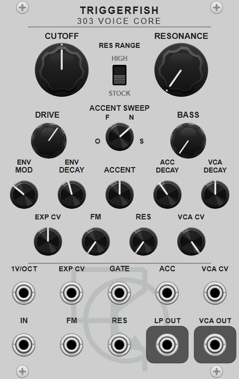
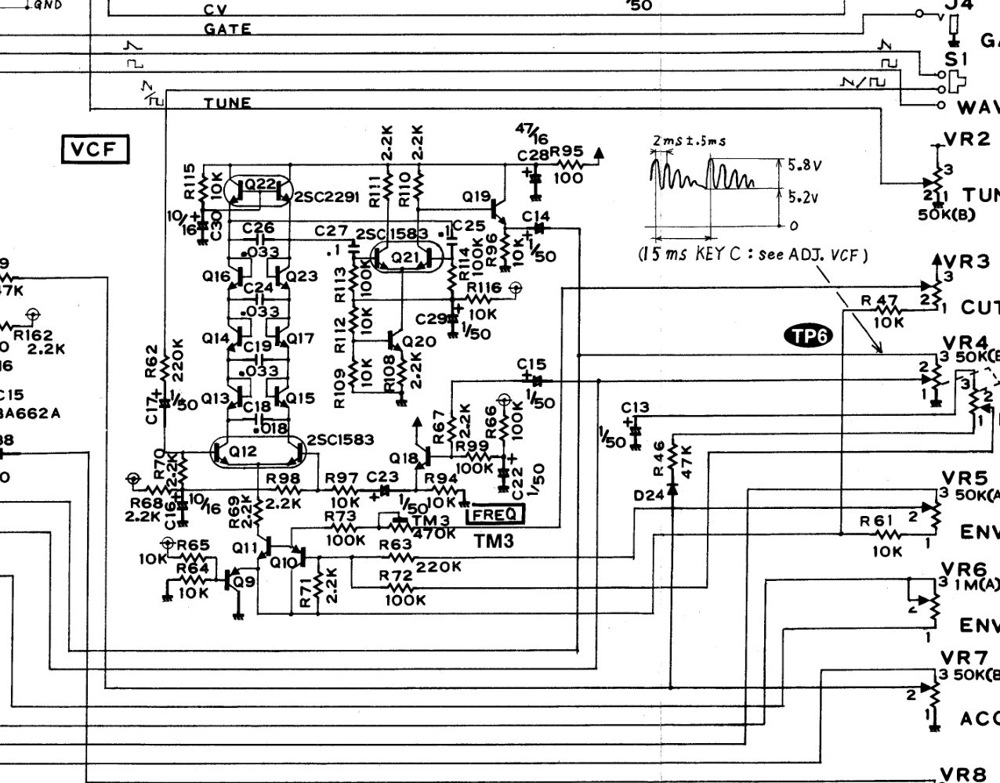
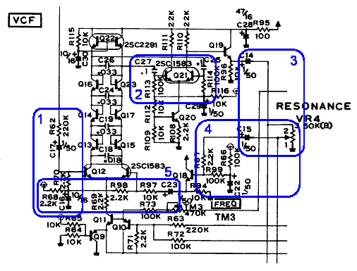
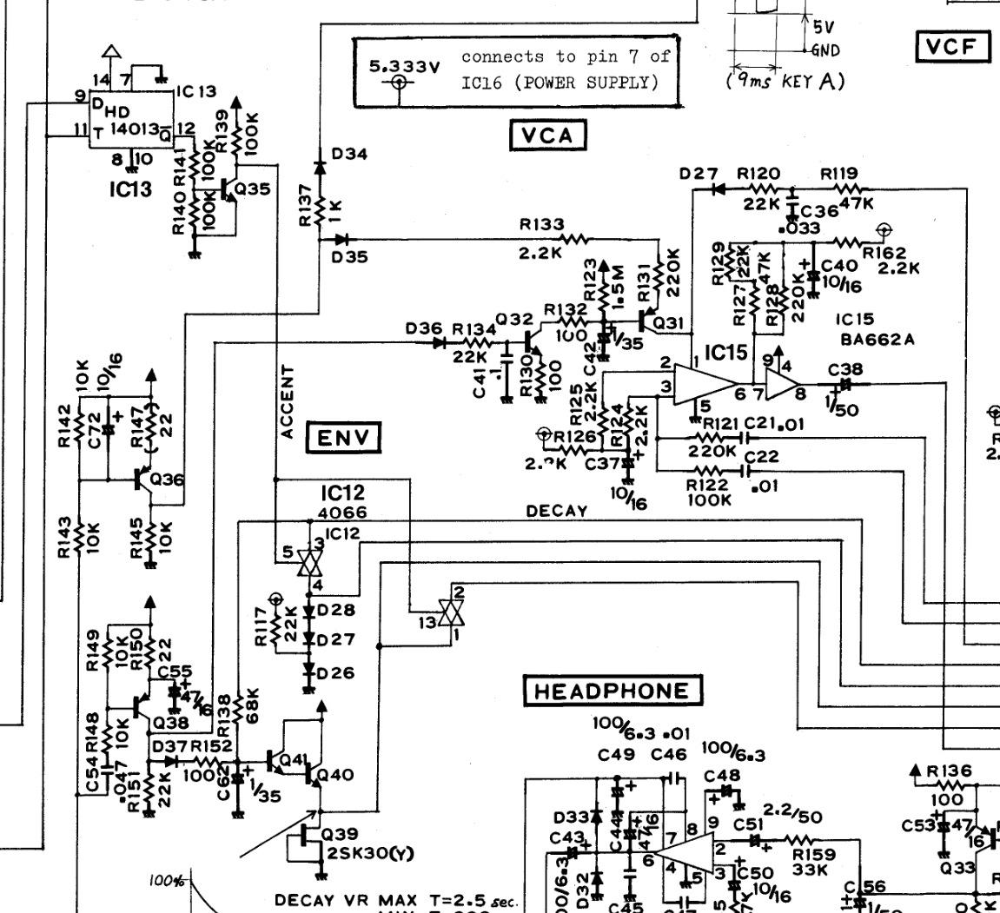
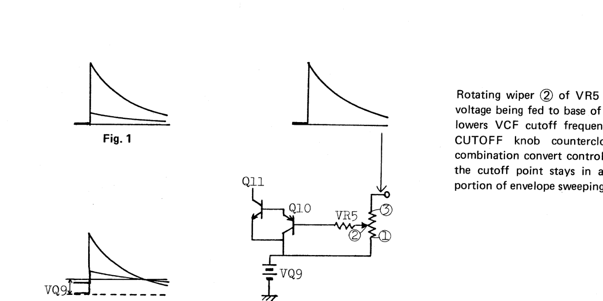

# 303 Voice Core technical report

<p align="center"></p>

The [module guide](../README.md#303-voice-core) describes the panel controls and
patching interface. This report describes the circuits represented by the
module and the equations evaluated by its DSP model.

## 1. Module architecture

`Tf303VoiceCore` combines four functions from the TB-303 signal path:

1. a four-stage resonant diode-ladder low-pass filter;
2. a filter envelope with the original accent-sweep behaviour;
3. a volume envelope with a separate accent pulse;
4. a voltage-controlled amplifier (VCA) based on the BA662 circuit.

The audio path is:

```text
IN -> diode-ladder filter -> LP OUT
                         -> VCA -> VCA OUT
```

`GATE` starts both internal envelopes. The filter envelope changes cutoff and
the volume envelope controls the VCA. `ACC` shortens the filter-envelope decay,
drives the filter's accent-sweep network, and adds a short pulse to the VCA
control current.

The cutoff control is the sum of the Cutoff knob, `1V/OCT`, attenuverted
`EXP CV`, and the internal filter envelope. `FM` adds AC-coupled linear
frequency modulation. Patching `VCA CV` replaces the internal volume envelope;
its amount knob scales the external 0--10 V signal. The VCA accent pulse remains
active with either control source.

The panel also exposes selected Devil Fish extensions: up to 66.6 times the
stock input drive, doubled resonance feedback, separate normal and accented
filter-envelope decays, variable volume-envelope decay or sustain, linear
filter FM, bass extension, and four accent-sweep modes.

Each polyphonic channel has independent filter, envelope, accent-memory, and
VCA state. `IN` determines the number of channels, and mono control inputs are
broadcast across them. The filter and VCA run at 4x sample rate by default,
with a 2x option in the context menu. The envelopes run at the Rack sample
rate. The combined cutoff trajectory and the VCA's main control trajectory are
interpolated to the internal audio rate.

### 1.1 Nominal voltage mapping

A Rack oscillator is expected to produce about 10 V peak-to-peak. At 0 dB
Drive, this is mapped to the junction voltage produced by the original 5.5 V
peak-to-peak oscillator after the 220 kΩ / 2.2 kΩ filter-input divider.
The inverse mapping returns the ladder state to Rack volts before it reaches
either output or the VCA.

Gate and Accent follow Rack's 0--10 V convention, cutoff tracking uses
1 V/octave, and the normalled volume envelope spans 0--10 V. Circuit overload
and Rack cable headroom are handled by smooth output-compliance curves described
in Section 3.7.

## 2. Circuit analysis

### 2.1 Diode ladder

<p align="center">
<a href="https://www.synfo.nl/servicemanuals/Roland/ROLAND_TB-303_SERVICE_NOTES.pdf"></a>
</p>

<p align="center"><em>Figure 1. TB-303 VCF and its panel connections. Q12 is
the input differential pair. The four ladder sections use C18, C19, C24, and
C26. Q21 and the surrounding network convert the final ladder state to the
filter output. Source: Roland TB-303 Service Notes, main-board schematic.</em></p>

Audio and resonance feedback meet at the input differential pair. The pair's
collector-current difference drives a chain of four capacitor states. The
diode-connected transistors between adjacent states respond to their voltage
differences, and the final junction connects the fourth state to the end of the
ladder. All five junction currents therefore participate in the large-signal
response.

For a matched transistor pair with differential voltage $v$, the normalized
current is

$$
\phi(v)=\tanh\!\left(\frac{v}{2V_T}\right),
$$

where $V_T$ is the thermal voltage. The DSP uses the dimensionless voltage
$x=v/(2V_T)$, so each junction law becomes $\tanh(x)$.

The first timing capacitor is 18 nF and the remaining three are 33 nF. Their
ratio is

$$
r=\frac{33}{18}=1.8333\ldots
$$

$$
c=r^{-1/4}=0.8593887047640296.
$$

The four normalized stage-rate factors are $rc,c,c,c$. Because their product
is $r c^4=1$, their geometric mean is one; $f_c$ therefore remains the
reference cutoff while the 18 nF first stage retains its faster response. The
common angular-rate factor is

$$
\Omega=2\pi f_c c.
$$

Let $x_0,\ldots,x_3$ be the four normalized capacitor voltages. Let $u$ be the
normalized signal arriving through the forward coupling network, $y_r$ the
normalized signal returned through the resonance network, and $k$ the feedback
gain. The five normalized junction currents are

$$
j_0=\tanh(u-ky_r),
$$

$$
j_1=\tanh(x_0-x_1),
$$

$$
j_2=\tanh(x_1-x_2),
$$

$$
j_3=\tanh(x_2-x_3),
$$

$$
j_4=\tanh(x_3).
$$

The continuous large-signal model is

$$
\dot{x}_0=\Omega r(j_0-j_1),
$$

$$
\dot{x}_1=\Omega(j_1-j_2),
$$

$$
\dot{x}_2=\Omega(j_2-j_3),
$$

$$
\dot{x}_3=\Omega(j_3-j_4).
$$

These four coupled nonlinear differential equations define the audio model.

For frequency-response analysis, setting $\tanh z\approx z$ gives the
small-signal ladder transfer. With complex frequency $s$ and normalized
frequency

$$
p=\frac{s}{2\pi f_c},
$$

the denominator is

$$
D(p)=p^4+(r+6)cp^3+(5r+10)c^2p^2
+(6r+4)c^3p+1.
$$

The corresponding ladder transfer is

$$
L(s)=\frac{1}{D\!\left(s/(2\pi f_c)\right)}.
$$

Its high-frequency slope approaches 24 dB/octave. Mutual loading and the 18 nF
first stage spread the poles, producing a broader transition than four
identical buffered one-pole sections.

### 2.2 Coupling and resonance network

<p align="center">
<a href="https://www.timstinchcombe.co.uk/index.php?pge=diode2"></a>
</p>

<p align="center"><em>Figure 2. AC-coupling groups surrounding the ladder,
annotated by Tim Stinchcombe. These components form the forward and resonance
transfer functions in addition to the four nonlinear ladder states.</em></p>

The ladder sits inside a larger AC-coupled signal path. The oscillator enters
through C17 and R62. The fourth ladder state reaches the filter output through
the Q19/Q20/Q21 network and C14. The Resonance potentiometer returns a variable
portion of that output through C15 to the input differential pair. This return
path closes the feedback loop around the complete four-stage ladder.

The surrounding RC networks contribute additional poles and zeros. Writing
$s$ for complex angular frequency in rad/s, the complete forward transfer from
the filter input to the ladder/output path is

$$
H_f(s)=1.06
\frac{s}{s+578.1}
\frac{s}{s+97.5}
\frac{s}{s+38.5}
\frac{s+109.9}{s+20.0}
\frac{s+34.0}{s+4.45}.
$$

The resonance-return transfer from the fourth ladder state back to the input
pair is

$$
H_r(s)=18.7
\frac{s}{s+578.1}
\frac{s}{s+97.5}
\frac{s}{s+38.5}
\frac{s}{s+20.0}
\frac{s+46.5}{s+7.41}
\frac{s+4.40}{s+4.45}.
$$

Combining these networks with the linearized ladder gives

$$
H(s)=\frac{L(s)H_f(s)}
{1+kL(s)H_r(s)}.
$$

Here $L(s)$ is the linearized ladder transfer from Section 2.1. This expression
is used to verify low-level frequency response. Audio processing evaluates the
five nonlinear junction laws, so drive and resonance change the waveform as
well as the linear response.

After the Resonance knob and CV are summed and limited to $q\in[0,1]$, the
feedback gain maps to

$$
k_{\mathrm{stock}}=0.78q,
$$

$$
k_{\mathrm{high}}=1.56q.
$$

The coefficient 0.78 calibrates the stock end-stop against the complete closed
loop. High mode follows the doubled-feedback Devil Fish modification and
extends well into self-oscillation.

### 2.3 Bass extension

The Devil Fish Bass modification increases C20 and C21 by a factor of ten,
lowering two AC-coupling corners after the ladder. These capacitors affect the
signal delivered to the output and VCA; the resonance return retains its stock
transfer.

The continuously variable reduction is

$$
H_b(s,b)=
\left(\frac{s+\omega_b}{s+\omega_b10^{-b}}\right)^2,
$$

$$
\omega_b=2\pi(24.66),
$$

where $0\leq b\leq1$. At $b=0$ each ratio is unity. At $b=1$ both poles move
down one decade, adding about 4 dB at 32 Hz while retaining DC blocking. The
24.66 Hz corner and the two-shelf reduction are calibrated from the complete
coupling response. A 10 ms parameter smoother prevents zipper noise when the
Bass knob moves.

### 2.4 Filter and volume envelopes

<p align="center">
<a href="https://www.synfo.nl/servicemanuals/Roland/ROLAND_TB-303_SERVICE_NOTES.pdf"></a>
</p>

<p align="center"><em>Figure 3. Envelope and VCA area of the main board.
IC12 and Q39–Q41 switch the envelope timing network. The upper control path
drives the BA662A VCA. The filter envelope also feeds the cutoff and accent
paths. C38 couples the VCA output to the Volume control.</em></p>

The TB-303 has two articulation contours:

- The filter envelope, called the main envelope generator (MEG) in the service
  documentation, jumps to its peak when a note starts and then decays
  exponentially. It controls cutoff and supplies both accent branches.
- The volume envelope, called the volume envelope generator (VEG), has a short
  delay and attack followed by decay while the gate is held. Releasing the gate
  closes the VCA through a separate release path.

Accent shortens the filter-envelope decay in the original instrument. The
Normal and Accent Decay knobs expose the two endpoints independently, following
the Devil Fish extension; the Accent voltage interpolates between them.

<p align="center">
<a href="https://www.synfo.nl/servicemanuals/Roland/ROLAND_TB-303_SERVICE_NOTES.pdf"></a>
</p>

<p align="center"><em>Figure 4. Roland's explanation of the filter-envelope
bias. Increasing Env raises the beginning of the cutoff sweep and lowers its
tail, keeping more of the decay in the filter's responsive range. Source:
TB-303 Service Notes, “VCF Envelope Modulation”.</em></p>

The resonance potentiometer has a second section in the accent circuit. At
one end, the accented filter envelope reaches the cutoff summing node mainly
through 47 kΩ and produces a sharp pulse. At the other end, it charges C13
through 147 kΩ and produces a rounded sweep. C13 retains charge between
closely spaced accents, so repeated accents interact.

The VCA accent branch passes the accented filter envelope through 47 kΩ and
33 nF. This short RC response softens the pulse before it adds to the VCA
control current.

### 2.5 BA662 VCA

IC15 in Figure 3 is a BA662A operational transconductance amplifier. The
filtered audio appears as a small differential voltage across its input pair.
The envelope-derived control current $I_{\mathrm{ABC}}$ sets the pair's
transconductance, so the same audio input produces more output current as the
envelope rises. The output mirror drives the 220 kΩ load, and the BA662 output
buffer drives C38 and the 50 kΩ Volume potentiometer.

For a matched differential pair,

$$
i_o=\eta I_{\mathrm{ABC}}
\tanh\left(\frac{v_d}{2V_T}\right),
$$

where $I_{\mathrm{ABC}}$ is the control current, $v_d$ is the differential
audio input, $V_T$ is the thermal voltage, and $\eta$ is the current transferred
through the input pair and output mirror. This equation gives both gain control
and audio saturation. Its slope at $v_d=0$ is

$$
g_m=\frac{\eta I_{\mathrm{ABC}}}{2V_T}.
$$

This slope sets the fully-open gain calibration. The runtime model evaluates
the complete $\tanh$ expression for every oversampled audio value.

## 3. DSP implementation

### 3.1 Sample-rate architecture

Let $f_s$ be the Rack sample rate and let $N\in\{2,4\}$ be the selected
oversampling factor. The internal audio rate is

$$
f_i=Nf_s.
$$

The input audio, logarithmic cutoff, linear FM, resonance, and VCA control each
pass through a matching seventh-order polyphase IIR interpolator. The forward
coupling network, nonlinear ladder, resonance return, Bass response, VCA, and
C38 output coupling are evaluated at the selected 2x or 4x internal sample
rate. Separate matching decimators return `LP OUT` and `VCA OUT` to the Rack
sample rate.

The filter and volume envelopes update once per Rack sample. The filter
envelope and filter accent are combined with cutoff before interpolation. The
volume envelope or external VCA CV forms the interpolated main VCA control. The
separate VCA accent state has a 1.551 ms RC time constant and is evaluated at
the Rack rate.

### 3.2 Coupling-section state

Each pole-zero factor in $H_f(s)$, $H_r(s)$, and $H_b(s)$ has the analog form

$$
H_a(s)=\frac{s+z}{s+p}
$$

where $p$ and $z$ are angular frequencies in rad/s. It is realized as a
topology-preserving one-pole state. At internal sample rate $f_i$, let $x$ be
the current input, $s_1$ the stored integrator state, and $\ell$ the current
low-pass value. The update is

$$
g=\tan\left(\frac{p}{2f_i}\right),
$$

$$
a=\frac{g}{1+g},
$$

$$
\ell=ax+(1-a)s_1,
$$

$$
y=x+\left(\frac{z}{p}-1\right)\ell,
$$

$$
s_1'=2\ell-s_1.
$$

Before committing the state update, the output can be written as an affine
function of the current input:

$$
y=Ax+B.
$$

For one section,

$$
A=1+\left(\frac{z}{p}-1\right)a,
$$

$$
B=\left(\frac{z}{p}-1\right)(1-a)s_1.
$$

If one section has $y=A_1x+B_1$ and the next has
$w=A_2y+B_2$, their cascade is

$$
w=(A_2A_1)x+(A_2B_1+B_2).
$$

Applying this composition to the six resonance sections gives

$$
y_r=A_rx_3^{n+1}+B_r,
$$

where $x_3^{n+1}$ is the fourth ladder state being solved for. The coefficients
$A_r$ and $B_r$ depend only on the stored RC states at the beginning of the
sample. This preview includes the complete resonance network in the nonlinear
solve; after the ladder state converges, the six RC states are advanced using
the solved $x_3^{n+1}$.

Four forward sections are evaluated before the ladder. The remaining
$s/(s+38.5)$ forward factor is evaluated after it, where it removes DC produced
inside the driven ladder. Together these sections realize the complete
$H_f(s)$ from Section 2.2.

### 3.3 Implicit ladder update

Let $\mathbf{x}^{n}$ be the four ladder states from the previous internal
sample and $\mathbf{x}^{n+1}$ the unknown states for the current sample. Their
midpoint is

$$
\mathbf{x}^{m}=\frac{\mathbf{x}^{n}+\mathbf{x}^{n+1}}{2}.
$$

The input junction is evaluated from the current forward signal and the
resonance preview $A_r x_3^{n+1}+B_r$. The other four junctions use the
midpoint states $\mathbf{x}^{m}$. Frequency prewarping gives the dimensionless
step coefficient

$$
\Gamma=2c\tan\left(\frac{\pi f_c}{f_i}\right),
$$

For trial state $\mathbf{x}$, evaluate the junction currents from Section 2.1
and collect their differences into

$$
\boldsymbol{\Phi}=
\bigl(r(j_0-j_1),\ j_1-j_2,\ j_2-j_3,\ j_3-j_4\bigr)^{\mathsf T}.
$$

The implicit update is the root of

$$
\mathbf{R}(\mathbf{x})=
\mathbf{x}-\mathbf{x}^{n}-\Gamma\boldsymbol{\Phi}=\mathbf{0}.
$$

Newton's method starts with $\mathbf{x}_0=\mathbf{x}^{n}$. At iteration $i$,
the analytic Jacobian
$\mathbf{J}_i=\partial\mathbf{R}/\partial\mathbf{x}$ gives the correction

$$
\mathbf{J}_i\boldsymbol{\Delta}_i=-\mathbf{R}(\mathbf{x}_i),
$$

$$
\mathbf{x}_{i+1}=\mathbf{x}_i+d_i\boldsymbol{\Delta}_i.
$$

The analytic Jacobian follows from

$$
\frac{d}{dz}\tanh z=1-\tanh^2z.
$$

The four adjacent ladder junctions produce a tridiagonal Jacobian. The
resonance preview makes $j_0$ depend on $x_3^{n+1}$, adding the entry in row 0,
column 3. A four-by-four Gaussian elimination with partial pivoting solves for
$\boldsymbol{\Delta}_i$.

The damping factor limits the largest state correction to one normalized unit:

$$
d_i=\frac{1}{\max\!\left(1,\max_j|\Delta_{i,j}|\right)}.
$$

This keeps a Newton step from crossing several saturated regions at once. The
solver performs at most eight iterations and stops when

$$
\max_j|R_j|<10^{-11}.
$$

If the iteration limit is reached, the model keeps the last finite bounded
iterate and increments a diagnostic counter. A non-finite state or a normalized
magnitude above 100 resets the affected channel.

### 3.4 Filter control and level mapping

#### Audio input and Drive

The original oscillator produces approximately 5.5 V peak-to-peak. R62 and
R70 attenuate it by $2.2/(220+2.2)$ before the filter input pair. Dividing this
voltage by the pair's $2V_T$ scale and mapping a 10 V peak-to-peak Rack signal
to the same operating point gives

$$
S_{\mathrm{in}}=
\frac{5.5\,[2.2/(220+2.2)]}
{2(0.02585)(10)}
=0.10533
$$

normalized units per Rack volt. With Drive $D$ in decibels,

$$
u_{\mathrm{normalized}}
=0.10533\,v_{\mathrm{in}}10^{D/20}.
$$

The marked 0 dB position therefore reproduces the stock junction drive. The
upper limit, 36.47 dB, is 66.6 times that level. Drive changes are smoothed with
a 10 ms time constant.

#### Cutoff and modulation

Let $P$ be the sum, in octaves, of the Cutoff knob, direct `1V/OCT` input,
attenuverted `EXP CV`, and internal filter-envelope contribution. The
exponential cutoff request is

$$
f_e=261.625565\,2^P.
$$

Linear `FM` is high-pass filtered at 5 Hz, then converted directly to a
frequency offset:

$$
\Delta f=200a_{\mathrm{FM}}v_{\mathrm{FM}}\ \mathrm{Hz}.
$$

Here $a_{\mathrm{FM}}$ is the bipolar FM amount and $v_{\mathrm{FM}}$ is the
input in volts. Full-scale ±5 V modulation therefore contributes ±1 kHz.
Pitch and linear FM are interpolated independently, converted to hertz at the
internal rate, and added:

$$
f_{\mathrm{request}}=f_e+\Delta f.
$$

The transistor cutoff control becomes asymptotic near zero current, and the
discrete solver requires margin below Nyquist. Define

$$
\operatorname{softplus}(x,h)=h\ln\!\left(1+e^{x/h}\right)
$$

and

$$
f_{\max}=\min(20\ \mathrm{kHz},0.45f_s).
$$

The cutoff passed to the ladder is

$$
f_c=f_{\max}-\operatorname{softplus}\!\left(
f_{\max}-\operatorname{softplus}(f_{\mathrm{request}},1\ \mathrm{Hz}),
10\ \mathrm{Hz}\right).
$$

This mapping follows the requested frequency through the ordinary operating
range and bends smoothly at both limits.

#### Output level and circuit compliance

After output coupling and Bass correction, the normalized ladder value $y_f$
is converted back to Rack volts:

$$
v_f=9.494y_f.
$$

This factor is the reciprocal of the input normalization to the stated
precision. The resonance-dependent output calibration is

$$
M_{\mathrm{stock}}=1+2q,
$$

$$
M_{\mathrm{high}}=1+3q.
$$

Here $q$ is the reconstructed panel resonance value. Let $M$ denote the value
for the selected resonance range. The modeled filter buffer
and BA662 output node remain linear through 8 V and approach an 11 V circuit
limit smoothly. For either polarity, define

$$
C(v)=\operatorname{sgn}(v)
\begin{cases}
|v|, & |v|\leq8,\\
8+3\tanh\!\left((|v|-8)/3\right), & |v|>8.
\end{cases}
$$

This continuous curve has unit slope at the 8 V join and progressively
compresses larger excursions. The uncorrected $v_f$ feeds the VCA, preserving
its calibrated input level. Makeup and circuit compliance are applied when
forming the two outputs:

$$
v_{\mathrm{LP}}=C\!\left(Mv_f\right),
$$

$$
v_{\mathrm{VCA}}=C\!\left(M\,V(v_f)\right),
$$

where $V(\cdot)$ is the nonlinear VCA path and $C(\cdot)$ is the modeled
circuit-output compliance. Placing $M$ after the VCA keeps output compensation
from increasing the VCA's distortion.

The fixed circuit and modular mappings are summarized here:

| Quantity | Value | Basis |
| --- | ---: | --- |
| Ladder capacitors | 18 nF, then 33 nF three times | Roland schematic |
| Rack-to-ladder input scale | 0.10533 per volt | Stock saw level and input divider |
| Stock feedback scale | 0.78 | Closed-loop calibration |
| High feedback scale | twice stock | Devil Fish documentation |
| Ladder-to-Rack scale | 9.494 | Reciprocal normalized-voltage conversion |
| Resonance makeup | $1+2q$ or $1+3q$ | Output-level calibration |
| Bass shelves | 24.66 Hz, two sections | Fit to the modified coupling response |
| Linear FM | 200 Hz/V at full amount | Modular control range |
| Rack-to-VCA differential scale | $\sqrt{2}$ mV/V | 5 V peak to 5 mV RMS reference point |
| VCA base and accent currents | 20 µA each at full scale | BA662 operating-point calibration |
| VCA output load | 220 kΩ | Roland schematic |
| Circuit compliance | 8 V knee, 11 V asymptote | Filter-buffer and VCA headroom calibration |
| Rack cable limit | 11.5 V knee, 11.7 V asymptote | Protected-rail output adapter |

### 3.5 Articulation model

#### Filter envelope

Let $a=\operatorname{clamp}(v_{\mathrm{ACC}}/10,0,1)$ be the normalized
Accent input. A Gate rising edge sets the filter-envelope state $e$ to one.
Its decay time is the geometric interpolation

$$
\tau_e=
\exp\left((1-a)\ln\tau_{\mathrm{normal}}
+a\ln\tau_{\mathrm{accent}}\right).
$$

between the Normal and Accent Decay settings. For each Rack sample,

$$
e[n+1]=e[n]\exp\left(-\frac{1}{f_s\tau_e}\right).
$$

The envelope value used for the current sample is taken before this decay
update. The resulting cutoff contribution, in octaves, is

$$
P_{\mathrm{env}}=
6a_{\mathrm{env}}(e-0.3137)
+2a_{\mathrm{accent}}e_{\mathrm{sweep}}.
$$

where $a_{\mathrm{env}}$ is the Env knob, $a_{\mathrm{accent}}$ is the Accent
knob, and $e_{\mathrm{sweep}}$ is the output of the accent-sweep circuit. The
0.3137 pivot represents the bias shown in Figure 4: increasing Env raises the
start of the sweep while lowering its late tail.

#### Filter accent sweep

For the Normal accent mode, the direct and capacitor-path gains are

$$
G_d=\frac{100}{147},
$$

$$
G_c=\frac{100}{247},
$$

$$
\tau_a=(147\ \mathrm{k\Omega}\parallel100\ \mathrm{k\Omega})
(1\ \mathrm{\mu F})=59.5\ \mathrm{ms},
$$

$$
\tau_r=(100\ \mathrm{k\Omega})(1\ \mathrm{\mu F})
=100\ \mathrm{ms}.
$$

Let $e_a=ae$ be the accented filter-envelope source and let $q$ be normalized
resonance. In Normal mode, the C13 state $c_a$ moves toward $G_c e_a$ with
$\tau_a$ while rising and $\tau_r$ while falling. Its output is

$$
e_{\mathrm{sweep}}=(1-q)G_de_a+q c_a.
$$

The state $c_a$ persists between notes, reproducing the interaction between
closely spaced accents. Off mode returns zero and discharges the state. Fast
mode uses a 10 ms leaky peak detector to emphasize the first accent in a run.
Slow mode uses four times the Normal attack and release times and twice its
capacitor target. The Fast and Slow timings are behavioural realizations of the
published Devil Fish descriptions.

#### Volume envelope and VCA accent

The VCA accent RC time constant is

$$
\tau_{\mathrm{VCA\,accent}}=
(47\ \mathrm{k\Omega})(33\ \mathrm{nF})
=1.551\ \mathrm{ms}.
$$

The VCA accent state follows $e_a$ through the 47 kΩ / 33 nF circuit. It is
added to the ordinary volume-envelope control current.

On a Gate rising edge, the volume envelope waits 4 ms in Stock mode or 0.5 ms
in Devil Fish mode, then rises linearly to one in 3 ms. While the Gate remains
high it decays exponentially toward the selected sustain level. On a Gate
falling edge, Stock mode holds the current value for 8 ms and closes linearly
over the next 8 ms. Devil Fish mode begins an exponential release with

$$
\tau_{\mathrm{release}}=1.1581186\ \mathrm{ms},
$$

which falls by approximately 60 dB in 8 ms.

For VCA Decay control $d\in[0,1]$, the decay time $\tau_v$ and sustain $s_v$
are

$$
\tau_v=0.016\left(\frac{3.5}{0.016}\right)^{2d},\qquad s_v=0,
\quad 0\leq d\leq0.5,
$$

$$
\tau_v=3.5\ \mathrm{s},\qquad s_v=2d-1,
\quad 0.5<d\leq1.
$$

Thus the first half of the knob selects a 16 ms to 3.5 s decay with zero
sustain; the second half raises sustain while retaining the 3.5 s decay.

### 3.6 BA662 VCA model

The VCA receives the filter signal $v_f$ before resonance makeup. Its input
mapping is

$$
v_d=\sqrt{2}\times10^{-3}v_f.
$$

A 5 V peak Rack signal therefore becomes a 5 mV RMS differential signal, the
nominal point used by the circuit reference. Let $e_v\in[0,1]$ be either the
internal volume envelope or the attenuated external VCA CV, and let
$e_a\in[0,1]$ be the VCA accent state after the Accent amount. The control
current is

$$
I_{\mathrm{ABC}}=
(20\ \mathrm{\mu A})e_v
+(20\ \mathrm{\mu A})e_a.
$$

The OTA evaluates the matched-pair law from Section 2.5 with
$V_T=25.85$ mV and $\eta=0.85$. The nominal current-transfer factor is based on
the BA662-family reference comparison. The 220 kΩ load converts output current
to voltage, and the factor 9.8181818 calibrates the fully open small-signal path
to approximately unity Rack gain:

$$
v_o=9.8181818(220\ \mathrm{k\Omega})
\eta I_{\mathrm{ABC}}
\tanh\!\left(\frac{v_d}{2V_T}\right).
$$

The BA662 output node then passes through the circuit-compliance function
$C(v_o)$ defined in Section 3.4. C38 and the 50 kΩ Volume load form the
output coupling high-pass with corner

$$
f_{\mathrm{HP}}=
\frac{1}{2\pi(50\ \mathrm{k\Omega})(1\ \mathrm{\mu F})}
=3.183\ \mathrm{Hz}.
$$

At the internal sample rate, a matched-pole low-pass state $\ell_c$ tracks the
coupled signal $x$:

$$
\alpha_c=-\operatorname{expm1}
\left(-\frac{2\pi f_{\mathrm{HP}}}{f_i}\right),
$$

$$
\ell_c[n]=\ell_c[n-1]+\alpha_c(x[n]-\ell_c[n-1]),
$$

$$
y[n]=x[n]-\ell_c[n].
$$

This recurrence is the discrete equivalent of the physical coupling capacitor.
The VCA output then receives resonance makeup and the final circuit-compliance
stage described in Section 3.4.

### 3.7 Rack cable headroom

The circuit-compliance curve from Section 3.4 is applied to `LP OUT` after
resonance makeup. In the VCA path it first represents BA662 output compliance,
then protects the final output after resonance makeup.

Each path is low-pass filtered by its decimator before the Rack-facing voltage
adapter. The adapter remains linear through 11.5 V and approaches 11.7 V:

$$
R(v)=\operatorname{sgn}(v)
\begin{cases}
|v|, & |v|\leq11.5,\\
11.5+0.2\dfrac{e}{\sqrt{1+e^2}}, & |v|>11.5,
\end{cases}
$$

where $e=(|v|-11.5)/0.2$. The 11.7 V asymptote keeps cable voltages inside
the protected Eurorack rail while preserving ordinary ±5 V audio unchanged.

## 4. Combined signal path

~~~text
at the Rack sample rate:
    detect Gate edges and normalize Accent
    update the filter envelope, C13 accent memory,
        volume envelope, and VCA accent state
    add Cutoff, 1V/OCT, EXP CV, and filter-envelope pitch
    high-pass FM and convert it to a linear-Hz offset
    choose internal volume envelope or patched VCA CV
    combine the VCA base control with its additive accent control

interpolate audio, log2 cutoff, linear FM, resonance, and VCA base control
to the selected 2x or 4x internal rate

for each internal sample:
    convert interpolated pitch to Hz and add interpolated linear FM
    apply the smooth lower and upper cutoff knees
    smooth Drive and Bass over 10 ms
    pass driven audio through the four pre-ladder forward sections
    form y_r = A_r * trial_state[3] + B_r from the resonance RC states
    solve R(trial_state) = 0 with damped Newton iterations
    store the solved ladder state
    advance the resonance RC states with solved_state[3]
    pass solved_state[3] through output coupling and the two Bass shelves
    convert the resulting filter value to Rack volts as v_f

    LP path:
        multiply v_f by resonance makeup
        apply circuit compliance

    VCA path:
        map v_f and the two VCA controls to differential voltage and current
        evaluate the BA662 matched-pair law and output compliance
        pass the result through the C38 coupling capacitor
        multiply by resonance makeup
        apply final circuit compliance

decimate LP and VCA paths independently
apply the Rack cable-voltage adapter to each result
~~~

## 5. Numerical validation

### 5.1 Diode ladder

The Python reference represents every coupling factor as a continuous one-pole
state and integrates those states together with the four nonlinear ladder
states using SciPy's DOP853 solver. It therefore supplies a continuous-time
reference for the discrete midpoint/TPT implementation. Low-level tests compare
the analytic response from 30 Hz to 6 kHz at host rates from 44.1 to 192 kHz.

For large-signal comparison, a sine input is analyzed over an integer number of
periods. The amplitude error for harmonic $m$ is

$$
\epsilon_m=
\frac{|A_{m,\mathrm{DSP}}-A_{m,\mathrm{ref}}|}
{|A_{m,\mathrm{ref}}|}.
$$

For a 220 Hz, 5 V peak input at 10-times drive, 1.5 kHz cutoff, 55% resonance,
and 50% Bass, the first five odd harmonics agree with the continuous reference
within 6.3%; the regression limit is 6.5%. Random abrupt parameter tests at
44.1, 48, 96, and 192 kHz remain finite in both oversampling modes.

Aliasing is estimated from a one-second, 997 Hz saturated output. FFT bins at
the physically valid in-band odd harmonics are removed; the RMS of all
remaining bins is divided by the fundamental. This non-harmonic residual is
-36.0 dBc at 2x and -47.7 dBc at 4x. The 4x regression limit is -45 dBc and at
least 8 dB below the 2x result.

### 5.2 BA662 reduction

The ngspice reference expands the Open Music Labs BA662 clone into individual
transistors and uses manufacturer models for modern matched devices. Separate
signals are recorded at the OTA current node, output buffer, and C38 output.
Each settled waveform is projected onto its first nine harmonics. A fractional
delay and scalar gain are fitted before the normalized residual is measured:

$$
\epsilon=\frac{\lVert r-gc\rVert_2}{\lVert r\rVert_2},
$$

where $r$ is the transistor reference and $c$ is the compact model. The first
table column compares the matched-pair equation with the transistor circuit at
the OTA node. The second compares dynamic transistor models with static
transistor models after the output buffer and C38, showing the contribution of
device capacitances.

| Case | Reduced/full OTA residual | Full/static coupled residual |
| --- | ---: | ---: |
| 1 kHz, 5 mV RMS, 20 µA | 0.00757% | 0.00529% |
| 1 kHz, 5 mV RMS, 5 µA | 0.00481% | 0.00450% |
| 1 kHz, 5 mV RMS, 40 µA | 0.01582% | 0.01010% |
| 1 kHz, 20 mV RMS, 20 µA | 0.03913% | 0.02387% |
| 1 kHz, 100 mV RMS, 20 µA | 0.20432% | 0.13442% |
| 10 kHz, 5 mV RMS, 20 µA | 0.05329% | 0.05142% |

At 1 kHz, 5 mV RMS differential input, and 20 µA control current, the
transistor reference produces 0.15434% THD and the reduced law produces
0.15514%. The output-buffer residual is 0.01616%, and C38 contributes
0.00139%.

### 5.3 Articulation and resampling

Tests verify filter-envelope decay interpolation, Stock and Devil Fish volume
envelope timings, tied gates, additive VCA accent, the 47 kΩ / 33 nF accent
timing, C13 memory, all four accent-sweep modes, external VCA normalization,
and interpolation of audio-rate controls. The 2x and 4x overload tests also
check level consistency and cable headroom.

## 6. Model boundaries

The ladder represents a nominal matched circuit at fixed thermal voltage. Real
units acquire additional variation from component tolerance, junction mismatch,
temperature, supply coupling, leakage, and semiconductor parasitic capacitance.
The complete surrounding coupling transfer is represented; the continuous
Bass control uses the calibrated two-shelf reduction from Section 2.3.

Normal accent mode follows the published component network. Fast and Slow are
behavioural realizations of the documented Devil Fish responses. Resonance
makeup, modular FM depth, Rack input/output calibration, and cable headroom are
module-level mappings listed in Section 3.4.

The VCA represents a calibrated nominal BA662 matched pair and has been checked
against a public modern-device clone. Unit-specific mismatch, Early effect,
control feedthrough, noise, temperature drift, and output-buffer parasitics
account for additional hardware variation.

## 7. Reproducing the comparisons

~~~console
uv run pytest tests/python/test_diode_ladder.py tests/python/test_ba662.py
uv run python tests/python/benchmark_diode_ladder.py
uv run python tests/python/benchmark_ba662.py
uv run python tests/python/reference_ba662_spice.py --ngspice /path/to/ngspice
~~~

The SPICE harness stores downloaded device models and generated output in the
ignored build/ba662-reference directory.

The principal implementation files are
[DiodeLadderFilter.hpp](../src/models/DiodeLadderFilter.hpp),
[Tb303Voice.hpp](../src/models/Tb303Voice.hpp),
[OtaVca.hpp](../src/models/OtaVca.hpp),
[AnalogOutputStage.hpp](../src/models/AnalogOutputStage.hpp), and
[Tf303VoiceCore.cpp](../src/Tf303VoiceCore.cpp). The independent references are
[reference_diode_ladder.py](../tests/python/reference_diode_ladder.py) and
[reference_ba662_spice.py](../tests/python/reference_ba662_spice.py).

## 8. References

1. Roland Corporation, [TB-303 Service Notes](https://www.synfo.nl/servicemanuals/Roland/ROLAND_TB-303_SERVICE_NOTES.pdf) — complete VCF, envelope, accent, VCA, panel wiring, component values, signal levels, and Roland's envelope-modulation explanation.
2. Tim Stinchcombe, [A Comprehensive TB-303 Diode Ladder Filter Model](https://www.timstinchcombe.co.uk/index.php?pge=diode2) — complete coupling and feedback network, six surrounding poles and zeros, and the closed-loop transfer.
3. Tim Stinchcombe, [Analysis of the Moog Transistor Ladder and Derivative Filters](https://www.timstinchcombe.co.uk/synth/Moog_ladder_tf.pdf) — unbuffered ladder analysis and the idealized diode-ladder polynomial.
4. Robin Whittle, [TB-303 unique accent and envelope characteristics](https://www.firstpr.com.au/rwi/dfish/303-unique.html) — MEG, VEG, VCA accent, accent-sweep circuit, and repeated-accent memory.
5. Robin Whittle, [Devil Fish user manual](https://www.firstpr.com.au/rwi/dfish/Devil-Fish-Manual.pdf) — overdrive, doubled resonance, filter FM, envelope ranges, and Fast/Normal/Slow accent behaviour.
6. Open Music Labs, [BA662 clone](https://www.openmusiclabs.com/projects/ba662-clone/index.html) — transistor-level reference topology used by the offline comparison.
7. Nexperia, [PMP4201Y matched NPN pair](https://www.nexperia.com/product/PMP4201Y) and [PMP5201Y matched PNP pair](https://www.nexperia.com/product/PMP5201Y) — device models used in the BA662 clone comparison.
8. Robin Schmidt, [Open303 TeeBeeFilter](https://github.com/RobinSchmidt/Open303/blob/313bf0d9ade7c1dcb6b3a74f5ea1780a29d70074/Source/DSPCode/rosic_TeeBeeFilter.h) — independent software comparison for resonance and level mapping.
9. Paul Batchelor, [Soundpipe tbvcf](https://github.com/PaulBatchelor/Soundpipe/blob/3efb43bdabd0ed23b17c694292b5a79f1692a3ea/modules/tbvcf.c) — independent software comparison for resonance-dependent output level.
10. Vadim Zavalishin, [The Art of VA Filter Design](https://www.discodsp.net/VAFilterDesign.pdf) — topology-preserving discretization and nonlinear feedback solution.
11. VCV Rack, [Voltage Standards](https://vcvrack.com/manual/VoltageStandards) — Rack pitch, audio, gate, and modulation conventions.
