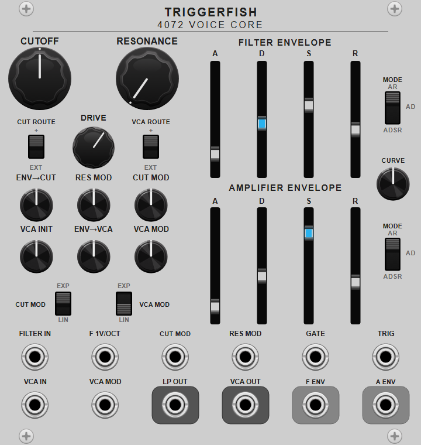
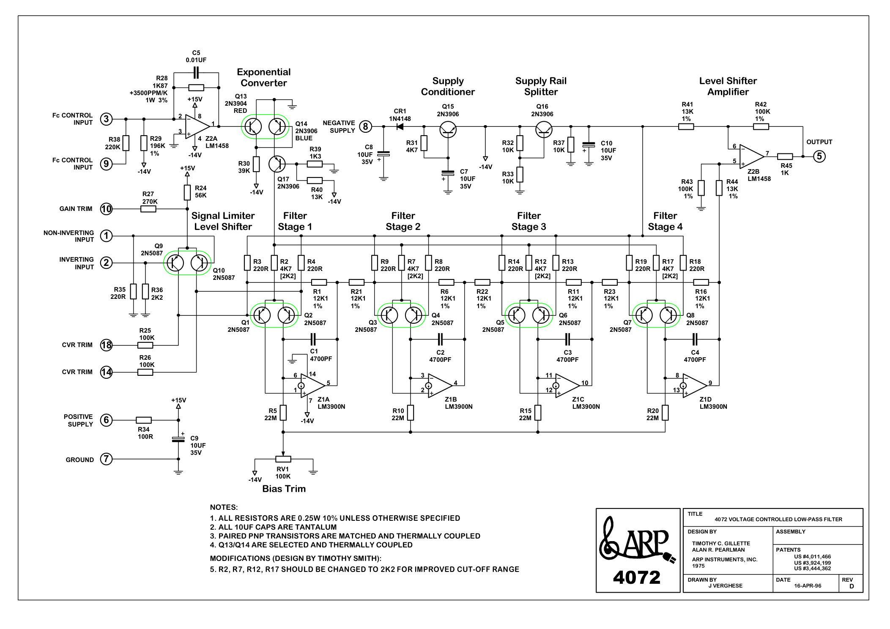
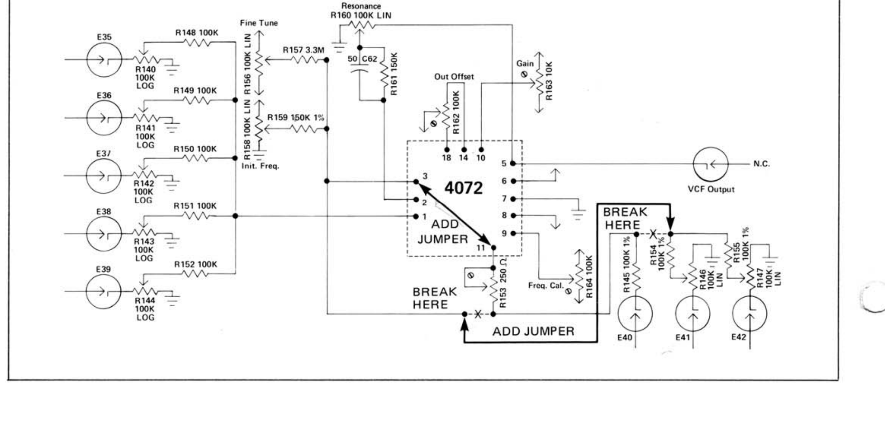
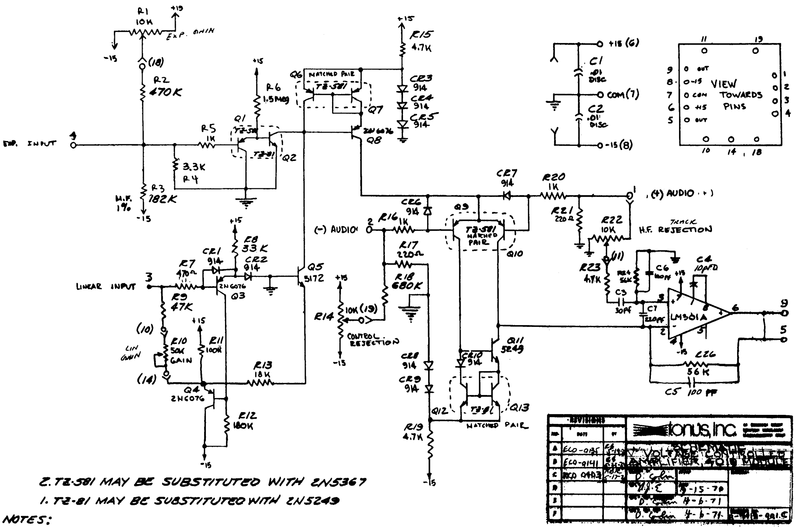
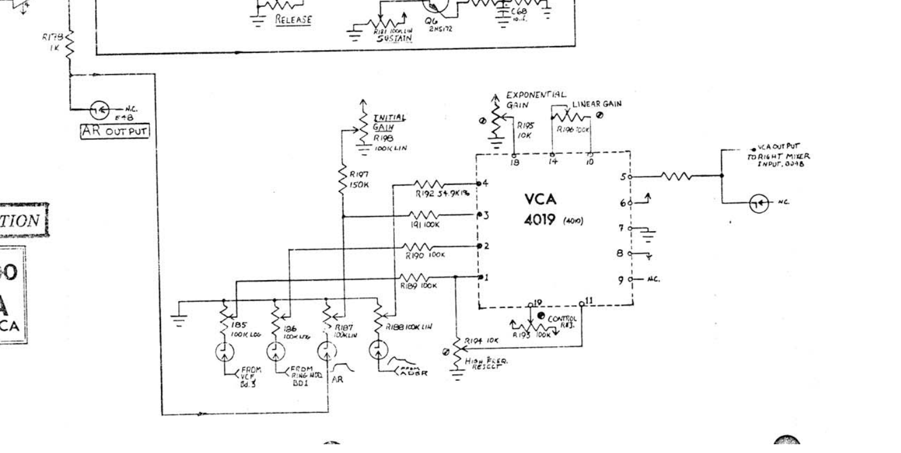
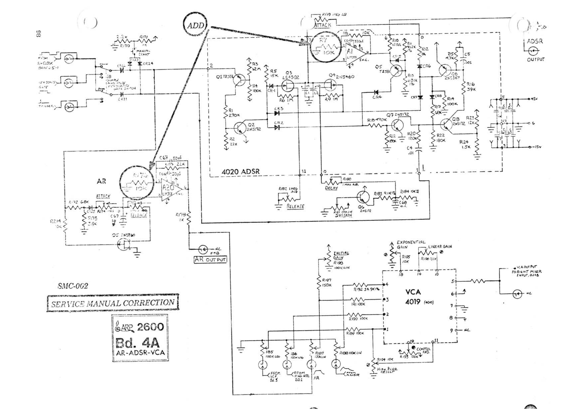
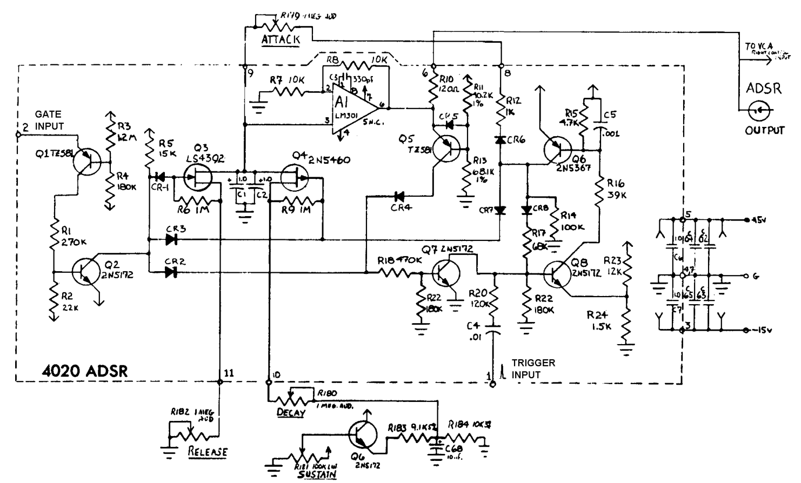
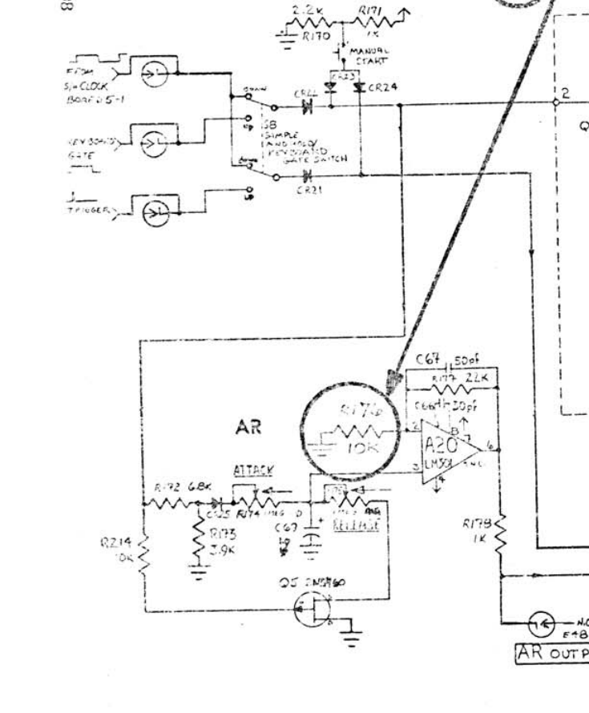

# 4072 Voice Core technical report

<p align="center"></p>

The [module guide](../README.md#4072-voice-core) describes the panel controls
and patching interface.

## Overview

`Tf4072VoiceCore` is a filter, VCA, and dual-envelope signal processor based on
the late ARP 2600's 4072 low-pass filter, 4019 VCA, 4020 ADSR, and board-4 AR
generator. Audio passes through the filter and is normalled into the VCA. Both
stages also have separate outputs, and an independent VCA input can replace the
normalled filter signal.

The two envelope generators can each operate as AR, AD, or ADSR. The left
envelope controls filter cutoff and the right envelope controls VCA gain. One
external modulation path per destination can add to or replace its internal
envelope and can use a linear or exponential control law. Both internal
envelopes are available as outputs. The default configuration uses the
board-4-style AR response for both destinations and additive external routing.

## 4072 filter

The original 4072 is a resonant four-pole low-pass filter built from four
matched PNP differential pairs and four LM3900 current integrators. The input
differential pair Q9/Q10 compares the audio input with the resonance feedback
and limits large differences smoothly. The four poles and output amplifier
are inside the 4072 submodule. The Resonance potentiometer and its return
network are on the ARP 2600 main board.

<p align="center">
<a href="https://till.com/arptech/pdf/4072.pdf"></a>
</p>

<p align="center"><em>Figure 1. Published ARP 4072 schematic. Input pins 1 and
2 drive Q9/Q10 at the left. Q1–Q8 and the four LM3900 sections form the filter
poles, and Z2B drives output pin 5. The panel controls are outside this
submodule. Click the image for the source PDF.</em></p>

<p align="center">
<a href="https://synthfool.com/docs/Arp/Arp2600/Arp2600ServiceManual.pdf"></a>
</p>

<p align="center"><em>Figure 2. ARP's Board 3 conversion drawing for the 4072.
R160 is the 100 kΩ Resonance potentiometer. Its wiper returns to filter input
pin 2 through R161 (150 kΩ), with C62 (50 pF) in parallel. R159 is part of the
Initial Frequency control and feeds cutoff-control pin 3. Click the image for
the source service manual.</em></p>

Audio enters pin 1 and reaches Q9. Feedback enters pin 2 and reaches Q10. The
Q9/Q10 collector currents drive four integrating stages, followed by the Z2B
output amplifier and pin 5. The resonance loop then leaves the 4072: Board 3
connects pin 5 through R160 and $R161\parallel C62$ before returning it to pin
2. The cutoff-control circuit supplies the same exponential control current to
all four poles.

### Input differential pair and resonance loop

The ARP 2600 audio mixer drives pin 1 and the Q9 base through a 100 kΩ series
resistor. Q10 receives the feedback signal at pin 2. Z2B drives pin 5 and
terminal 3 of R160. Terminal 1 of R160 is grounded, so its wiper selects a
fraction of the final filter output. The wiper reaches pin 2 through R161,
with C62 in parallel to increase the feedback near the top of the audio band.

Z2B is the shared output and feedback amplifier. It follows the fourth pole
and drives both the VCF output and R160. Board 3 adds only the passive
R160–R161–C62 return network.

Q9/Q10 share an approximately fixed tail current. A small base-voltage
difference divides that current almost linearly; a larger difference steers
most of it into one transistor. This produces smooth, symmetric limiting of
the error between the audio and feedback signals and bounds the drive into
Q1/Q2 during high resonance and self-oscillation.

Let $u$ be the Rack input after Drive, $q$ the normalized Resonance control,
and $y$ the final filter output. At low frequency and maximum Resonance, the
external and on-module resistors give the base-voltage ratios

$$
a=\frac{220}{100000+220}=0.00219517,
$$

$$
b=\frac{2200}{150000+2200}=0.01445466.
$$

The DSP represents the feedback network with the frequency-independent factor
$qb$. This approximation drops the changing source resistance at R160's wiper
and the high-frequency bypass through C62.

At 27 °C, the thermal voltage is $V_T=25.85$ mV. The 56 kΩ emitter resistor
sets the pair's approximate tail current:

$$
I_L=\frac{15-0.65}{56\ \mathrm{k\Omega}}=256.25\ \mu\mathrm{A}.
$$

The Q9/Q10 base-to-base voltage is

$$
v_L=au-qby,
$$

and its collector-current difference, normalized to the pair's tail current,
is

$$
\ell=\tanh\!\left(\frac{v_L}{2V_T}\right).
$$

The corresponding collector-current difference is $i_\Delta=I_L\ell$.

For $|v_L|\ll2V_T$, $\ell\simeq v_L/(2V_T)$. At large positive or negative
$v_L$, it approaches $+1$ or $-1$, so the differential collector current
cannot exceed the available tail current.

A 5 V audio signal therefore applies 10.98 mV, or $0.425V_T$, to Q9. At
maximum Resonance, a 5 V output applies 72.27 mV, or $2.796V_T$, to Q10. Their
ratio is $b/a=6.5848$: the hardware deliberately drives the feedback side of
Q9/Q10 much harder than the audio side.

Converting the Q9/Q10 differential collector current into the voltage that
drives the first pole requires the collector loads. The reference-side Q1/Q2
base node has a 220 Ω load. The signal-side 220 Ω resistor is also loaded by
the 12.1 kΩ input and local-feedback paths, giving

$$
R_b=\left(\frac{1}{220}+\frac{1}{12100}+\frac{1}{12100}\right)^{-1}
=212.2807\ \Omega.
$$

The two collector loads give the nominal equivalent first-stage peak

$$
R_L=\frac{220+R_b}{2}=216.1404\ \Omega,
$$

$$
L_{\mathrm{nom}}=I_L(12.1\ \mathrm{k\Omega})\frac{R_L}{R_b}
=3.1570\ \mathrm{V}.
$$

The original 4072 submodule labels connector pin 10 “GAIN TRIM”. It is an
internal service adjustment. Board trimmer R163 drives pin 10, and the service
procedure adjusts it until the open filter has unity gain. The DSP represents
that calibration by setting $L=3.06172$ V, equivalent to 0.96982 times the
nominal component estimate.

The equivalent voltage driving the first filter pole is therefore $L\ell$.

### Four current-integrator poles

The four poles use matched PNP pairs Q1/Q2, Q3/Q4, Q5/Q6, and Q7/Q8. Each
pair supplies a collector-current difference to one section of Z1. The LM3900
is a Norton, or current-differencing, amplifier. Each section and its C1–C4
capacitor convert the pair's current difference into the pole's state voltage
and isolate it from the following stage. The preceding pole and the pole's own
output both reach the driven transistor base through 12.1 kΩ resistors. This
local negative feedback keeps the base-to-base voltage small during ordinary
operation and progressively limits the integrating current at high levels.
These four local loops are separate from the global resonance loop between
pins 5 and 2.

Let $x_0,\ldots,x_3$ be the AC components of the four LM3900 outputs. With the
inverting pole polarity included in the signs of the state variables, the
local-pair drive voltages are

$$
z_0=L\ell+x_0,
$$

$$
z_i=x_{i-1}+x_i,\qquad i=1,2,3.
$$

The loaded base resistance $R_b$ also determines the differential base
voltage of each local pair:

$$
v_{BE,\Delta}=\frac{R_b}{12.1\ \mathrm{k\Omega}}z_i=\frac{z_i}{57}.
$$

Using the same thermal voltage, its normalized collector-current difference is

$$
\tanh\!\left(\frac{v_{BE,\Delta}}{2V_T}\right)
=\tanh(\alpha z_i),
$$

where

$$
\alpha=\frac{R_b}{(12.1\ \mathrm{k\Omega})(2V_T)}
=0.3393396\ \mathrm{V}^{-1}.
$$

The reciprocal $1/\alpha=2.9469$ V is the internal voltage that produces a
$\tanh$ argument of one. A larger $\alpha$ produces stronger current limiting
and less linear headroom.

With $\omega_c=2\pi f_c$, the continuous-time pole equations are

$$
\dot{x}_0=-\frac{\omega_c}{\alpha}
\tanh\!\left[\alpha(L\ell+x_0)\right],
$$

$$
\dot{x}_i=-\frac{\omega_c}{\alpha}
\tanh\!\left[\alpha(x_{i-1}+x_i)\right],
\qquad i=1,2,3.
$$

For small signals, $\tanh(\alpha z)\simeq\alpha z$, so the factors of
$\alpha$ cancel and each stage has the intended linear pole frequency.

### Output amplifier and linear response

The fourth pole feeds the inverting Z2B level-shifter amplifier. R41 and R42
set its gain magnitude:

$$
G=\frac{100}{13}=7.69231.
$$

The state signs absorb the circuit inversions, so the model writes the final
output as $y=Gx_3$. This is the output used by both the panel connection and
the external R160 resonance network.

For small signals, one stage becomes

$$
P(s)=-\frac{\omega_c}{s+\omega_c}.
$$

The complete linearized transfer is

$$
H(s)=\frac{GAP(s)^4}{1+K P(s)^4},
$$

where

$$
A=\frac{La}{2V_T},
\qquad
K=\frac{qLbG}{2V_T}.
$$

In the reduced model, $K=6.5848$ at full Resonance. Four identical ideal poles
begin sustained oscillation near $q=4/6.5848=0.6075$; the nonlinear Q9/Q10
pair bounds the oscillation level.

### Discrete solve

The filter runs at an internal sample rate $f_{s,i}$ and prewarps each pole:

$$
\gamma=2\tan\!\left(\frac{\pi f_c}{f_{s,i}}\right).
$$

With $x_m=(x_n+x_{n+1})/2$ and $\Phi(x_m)$ denoting the vector of four local
PNP-pair currents, the implicit residual is

$$
R(x_{n+1})=x_{n+1}-x_n+\frac{\gamma}{\alpha}\Phi(x_m).
$$

Newton iteration uses the analytic $4\times4$ Jacobian. Its stage terms are
lower-bidiagonal, with a row-0, column-3 term from resonance feedback. Partial
pivoting solves each update, corrections above two state units are damped, and
the residual tolerance is $10^{-11}$. After eight unsuccessful iterations,
the previous valid state is held for one internal sample.

The output level shifter is linear to 10 V and approaches 13.5 V through a
smooth `tanh` compliance curve. A second unity-slope safety curve handles
resampler overshoot without producing a flat clipped segment.

### Cutoff and modulation

The cutoff knob, `F 1V/OCT`, and the internal filter envelope use Rack's
exponential pitch convention. Let $c_f$ equal one when the internal envelope is
active and zero when a patched `CUT MOD` input is set to `EXT`. The internal
pitch is

$$
f_c=f_{\mathrm{C4}}2^p,
$$

$$
p_i=p_{\mathrm{knob}}+V_{\mathrm{F\ 1V/oct}}
+0.5c_fa_{\mathrm{env}}E_f.
$$

Here $E_f$ is the internal 0–10 V filter-envelope output. A patched `CUT MOD`
input supplies the attenuverted voltage

$$
m_f=a_{\mathrm{mod}}V_{\mathrm{CUT\ MOD}}.
$$

In EXP mode the requested cutoff is

$$
f_c=f_{\mathrm{C4}}2^{p_i+m_f}.
$$

At 100% amount this gives the standard 1 V/oct response. In LIN mode it is

$$
f_c=f_{\mathrm{C4}}2^{p_i}+(200\ \mathrm{Hz/V})m_f.
$$

The linear mode is bipolar and can drive the requested frequency below zero;
the filter's smooth low-frequency knee keeps the numerical coefficient finite.
With `CUT MOD` patched, `+` leaves $c_f=1$ and `EXT` sets $c_f=0$. An unpatched
input always leaves $c_f=1$.

The knob spans 10 Hz to 20 kHz and defaults to 500 Hz. The filter follows the
4072 topology, while its control range incorporates ARP's published change of
the four stage-frequency resistors from 4.7 kΩ to 2.2 kΩ. This removes the
original instrument's unintended cutoff limitation. A soft knee below 20 kHz
keeps the numerical coefficients finite near the limit of Rack sample rates.

Resonance CV is scaled so a 10 V signal at 100% traverses the full resonance
range. Drive spans silence to +24 dB and defaults to 0 dB.

## 4019 VCA

The original 4019 is a DC-coupled VCA with a matched transistor input pair,
current mirrors, and an LM301 transimpedance output stage. Independent linear
and exponential control circuits set the pair's tail current and therefore
the audio gain.

<p align="center">
<a href="https://till.com/arptech/pdf/4019.pdf"></a>
</p>

<p align="center"><em>Figure 3. ARP 4019 schematic. The differential audio
pair Q9/Q10 is at centre right, the linear and exponential control-current
circuits are at left, and the LM301 output stage is at lower right. Click the
image for the source PDF.</em></p>

<p align="center">
<a href="https://synthfool.com/docs/Arp/Arp2600/Arp2600ServiceManual.pdf"></a>
</p>

<p align="center"><em>Figure 4. Board-4 wiring around the 4019. The external
audio and control resistors and the Initial Gain, Linear Gain, Exponential
Gain, AR, and ADSR connections are shown. Click the image for the source
service manual.</em></p>

Board 4 sends the two audio signals through 100 kΩ resistors to pins 1 and 2.
Inside the 4019, these pins drive opposite sides of Q9/Q10. The linear and
exponential control circuits set the pair's tail current and therefore its
gain. The current mirrors route the Q9/Q10 collector-current difference to the
LM301, which converts it into the output voltage.

### Audio path

Each audio input passes through a 100 kΩ Board-4 resistor, a 1 kΩ series
resistor inside the 4019, and a 220 Ω shunt at the corresponding Q9/Q10 base.
The resulting input scale is

$$
S=\frac{220}{100000+1000+220}=0.0021734835.
$$

For the external differential audio voltage $v_d$ and tail current $I_t$, the
matched pair produces the collector-current difference

$$
i_o=I_t\tanh\!\left(\frac{Sv_d}{2V_T}\right),
$$

$$
v_{o,0}=R_f i_o,
$$

where $R_f=56$ kΩ and $v_{o,0}$ is the low-frequency output before the LM301
bandwidth limit. This $\tanh$ law gives the VCA its gradual overload
characteristic.

At small signal levels, unity audio gain requires

$$
I_{t,u}=\frac{2V_T}{R_fS}=424.7625\ \mu\mathrm{A}.
$$

### Gain control

Linear and exponential controls follow the ARP specifications. With initial
gain $g_0$, linear control voltage $V_L$, and exponential control voltage
$V_E$, their gain contributions are

$$
g_L=\frac{V_L}{10},
$$

$$
g_E=10^{(V_E-10)/2},
$$

$$
g=g_0+g_L+g_E,
$$

$$
I_t=I_{t,u}g.
$$

The linear path reaches unity at 10 V. The exponential path has 10 dB/V
sensitivity, reaches unity at 10 V, and contributes $10^{-5}$ gain at 0 V,
matching the specified 100 dB range. Initial Gain and the two CV contributions
sum before setting the Q9/Q10 tail current.

The internal amplifier envelope uses the circuit's linear control path. Let
$c_a$ equal one when that envelope is active and zero when a patched `VCA MOD`
input is set to `EXT`. With envelope amount $a_a$ and external modulation
amount $a_m$,

$$
V_{L,\mathrm{int}}=c_aa_aE_a,
$$

$$
m_a=a_mV_{\mathrm{VCA\ MOD}}.
$$

In LIN mode, $V_L=V_{L,\mathrm{int}}+m_a$ and $V_E=0$. In EXP mode,
$V_L=V_{L,\mathrm{int}}$ and $V_E=m_a$. Thus the external modulation law can
change without changing the circuit-appropriate linear law of the internal
amplifier envelope. With `VCA MOD` patched, `+` leaves $c_a=1$ and `EXT` sets
$c_a=0$; an unpatched input always leaves $c_a=1$.

### Output bandwidth

The Q9/Q10 collector-current difference reaches the LM301 transimpedance
stage through the current mirrors. Its R26/C5 feedback network contributes the
pole

$$
f_o=\frac{1}{2\pi(56\ \mathrm{k\Omega})(100\ \mathrm{pF})}
=28.4205\ \mathrm{kHz}.
$$

In the DSP model, this one-pole state uses the exact exponential coefficient
for each internal sample.

## Envelope generators

The ARP 2600 uses two different envelope circuits: the 4020 ADSR and a simpler
AR generator on Board 4.

<p align="center">
<a href="https://synthfool.com/docs/Arp/Arp2600/Arp2600ServiceManual.pdf"></a>
</p>

<p align="center"><em>Figure 5. Corrected ARP 2600 Board-4 schematic. The AR
generator is at left, the 4020 ADSR is at upper right, and the 4019 VCA and its
panel wiring are below them. Click the image for the source service manual.</em></p>

The module makes both circuit responses available in each generator. A third
AD position derives a one-shot envelope from the ordinary RC Attack curve and
Decay control.

### 4020 ADSR

<p align="center">
<a href="https://till.com/arptech/pdf/4020.pdf"></a>
</p>

<p align="center"><em>Figure 6. ARP 4020 ADSR schematic. Gate enters at pin 2,
Trigger at pin 1, and the timing network is centred on Q3/Q4 and C1/C2. The
external Attack, Decay, Sustain, and Release controls surround the submodule.
Click the image for the source PDF.</em></p>

Gate establishes the held or releasing state, while a Trigger pulse starts
Attack. During Attack the timing network charges toward +15 V. A1 detects the
+10 V peak and switches the circuit to Decay. The Decay network then moves the
output toward the Sustain setting, where it remains while Gate is high. Gate
removal selects Release.

Normalizing the +10 V envelope peak to one gives the Attack response

$$
v_A(t)=1.5\left(1-e^{-t/\tau_A}\right),
$$

and a zero-level attack reaches its peak after

$$
T_A=\tau_A\log3.
$$

### Board-4 AR

<p align="center">
<a href="https://synthfool.com/docs/Arp/Arp2600/Arp2600ServiceManual.pdf"></a>
</p>

<p align="center"><em>Figure 7. Board-4 AR circuit enlarged from Figure 5. The
Attack and Release controls set the charging and discharging paths around
timing capacitor C69, Q5 is the Gate-controlled switch, and A20 buffers the AR
output. Click the image for the source service manual.</em></p>

The AR responds directly to Gate. A high Gate charges C69 through the Attack
resistance and then holds the envelope at its peak. A low Gate discharges C69
through the Release resistance. Its sequence is therefore Attack, Hold, and
Release, with the direct RC curve set by C69 and the two timing resistances.

### AD extension

AD uses the AR circuit's ordinary RC Attack shape, then falls automatically to
zero using the Decay slider. A rising Gate or Trigger starts the one-shot, and a
Trigger pulse can restart it while Gate remains high. Sustain, Release, and the
Gate falling edge do not alter an active AD cycle.

### Timing curves

Decay, release, and both AR segments use ordinary RC responses. The reported
six-second ADSR maximum corresponds closely to three time constants:

$$
T_{95}=-\tau\log(0.05)=\tau\log20.
$$

For a selected segment time $T$, let $u=t/T$. The DSP envelope segments use
the endpoint-normalized family

$$
R(u,c)=\frac{\operatorname{expm1}(-cu)}
 {\operatorname{expm1}(-c)},
\qquad 0\le u\le1,
$$

with $R(u,0)=u$. A rising segment is

$$
y(u)=y_0+(y_1-y_0)R(u,c).
$$

The same interpolation handles falling segments. It reaches the selected
endpoint at the displayed time and remains stable close to a linear curve.
The stock centre values are

$$
c_A=\log3
$$

for ADSR Attack, and

$$
c_R=\log20
$$

for ADSR Decay/Release, AR Attack/Release, and both AD segments.

The shared Curve knob varies these coefficients geometrically. At its left
limit, $c_A=0.1$ and $c_R=0.25$, approaching straight segments. At its right
limit, $c_A=\log1000$ and $c_R=8$, producing tighter exponential motion. The
centre position follows the original circuits.

### Ranges and triggering

The common slider ranges accommodate both generators:

| Segment | Software range | Published ADSR range | Published AR range |
|---|---:|---:|---:|
| Attack | 1.4 ms–5 s | 1.4 ms–1.5 s | 20 ms–5 s |
| Decay | 6.4 ms–6 s | 6.4 ms–6 s | — |
| Release | 0.52 ms–6 s | 0.52 ms–6 s | 2.5 ms–5 s |

The extended common range permits fast AR attacks. Both envelopes default to
AR with 1.4 ms Attack and 1 s Release; Decay also defaults to 1 s. ADSR mode
uses all four sliders. AR uses Attack and Release and holds its peak while Gate
remains high. AD uses Attack and Decay and falls without waiting for Gate to end.

The original 4020 has separate Gate and Trigger inputs. The module follows that
behaviour when Trigger is patched: Gate enables the ADSR, and Trigger starts or
retriggers Attack while Gate is high. With Trigger unpatched, a Gate rising
edge starts Attack for convenient gate-only patches. AR responds only to Gate,
and Gate removal starts Release continuously from the current value. In AD,
either a Gate edge or Trigger pulse starts or retriggers the one-shot. Both
envelope outputs are 0–10 V.

## Numerical comparisons

### Filter

The continuous four-state equations were integrated with SciPy DOP853 using
`rtol=2e-11`, `atol=2e-12`, and a maximum step of $1/(8f_s)$. The table gives
production magnitude error relative to that reference at 48 kHz.

| Cutoff | Input | 2x | 4x |
|---:|---:|---:|---:|
| 8 kHz | 8 kHz | +0.301 dB | +0.075 dB |
| 12 kHz | 12 kHz | +0.562 dB | +0.052 dB |
| 8 kHz | 18 kHz | −1.518 dB | −0.339 dB |
| 12 kHz | 18 kHz | −0.840 dB | −0.217 dB |

At 4x, a 1 kHz, 50 V-peak stress signal with 2 kHz cutoff and 0.55 resonance
matched the reference harmonic amplitudes within 0.40% through the ninth
harmonic. An 80 V-peak case at 8 kHz cutoff matched within 0.23%.

At an 800 Hz requested cutoff and full resonance, the continuous model
oscillated at 735.619 Hz with 6.63671 V peak. Production 4x gave 735.626 Hz
and 6.63721 V peak.

### VCA

A manufacturer-model 2N3906 differential-pair proxy was evaluated in ngspice
at five tail currents. After fitting effective thermal voltage, its maximum
normalized-current difference from the `tanh` reduction was 0.019% at unity
current. Using the fixed 25.85 mV production value gave 0.207% maximum error.

The 4x VCA magnitude error relative to its analog 56 kΩ/100 pF pole was
0.0003 dB at 1 kHz, 0.0371 dB at 10 kHz, and 0.0889 dB at 20 kHz. A 1 kHz
nonlinear comparison gave:

| Input peak | Production THD | 16x continuous proxy |
|---:|---:|---:|
| 0.1 V | 0.000147% | 0.000147% |
| 1 V | 0.014655% | 0.014650% |
| 5 V | 0.362525% | 0.362409% |
| 10 V | 1.404421% | 1.403971% |

### Envelopes

The DSP ADSR Attack and the nominal 4020 equation both reach 36.0% at
one quarter of the selected time and 63.4% at one half. Their curves coincide
over the complete segment.

For Decay and Release, endpoint-normalized $\log20$ curves have 0.0384
full-scale RMS difference from an unbounded RC over one displayed segment. The
remaining 0.05 endpoint difference is the physical RC tail that the DSP
finishes cleanly at the selected time.

## Oversampling

The filter and VCA nonlinearities use the repository's seventh-order
polyphase IIR half-band resampler at 2x or 4x. The default is 4x. The filter
measurements at a 48 kHz host rate show the largest tested upper-band magnitude
error improving from 1.52 dB at 2x to 0.34 dB at 4x.

With the VCA input unpatched, the filter feeds the VCA directly at the internal
rate, avoiding an intermediate downsampling and upsampling stage. The LP and
VCA outputs use independent decimators with matched phase. A patched VCA input
uses the VCA's own audio interpolator.

The envelopes are evaluated at the host rate. Their millisecond-to-second time
constants leave little energy near the host Nyquist frequency. Audio, cutoff
pitch, linear cutoff FM, resonance, and the two VCA control voltages are
reconstructed with independent matching polyphase interpolators before entering
the nonlinear path. Exponential cutoff is converted from pitch to hertz at the
internal rate and then summed with reconstructed linear FM.

## Model boundaries

The filter reduction omits transistor mismatch, finite beta and Early effect,
LM3900 mirror error, op-amp slew and offset, temperature drift, component
tolerance, parasitics, and supply asymmetry. The control-current converter is
reduced to its frequency calibration, including ARP's published correction for
the original cutoff-range limitation.

The VCA reduction omits component-dependent offset, control feedthrough, noise,
mirror asymmetry, and LM301 open-loop dynamics beyond the feedback pole. These
effects vary among calibrated units and can produce VCA thump. The 16x control
limit and smooth output compliance are implementation safety bounds.

The envelope equations represent nominal timing networks. Unit tolerances,
the slow tail and short high-frequency hitch measured on a modern 2600 clone,
and the original keyboard's approximately 15 ms delayed trigger are omitted.

## Reproducing the comparisons

Build the Python extension and run the regression suite:

```powershell
.\dev.ps1 python-test
```

Print the filter and VCA comparison tables:

```powershell
uv run python tests/python/benchmark_arp4072.py --full
uv run python tests/python/benchmark_arp4019.py
```

Run the device-level 2N3906 differential-pair comparison with ngspice:

```powershell
uv run python tests/python/reference_arp4019_spice.py --ngspice C:/path/to/ngspice
```

Generated decks, logs, and sweep data are written beneath
`build/arp4019-reference`.

The independent equations are in
`tests/python/reference_arp4072.py`,
`tests/python/reference_arp4019.py`, and
`tests/python/reference_arp_envelope.py`.

## References

1. [ARP Models 2600–2606 Service Manual](https://synthfool.com/docs/Arp/Arp2600/Arp2600ServiceManual.pdf) — module wiring, calibration, envelope operation, VCA control laws, and corrected schematics.
2. [ARP 4072 schematic](https://till.com/arptech/pdf/4072.pdf) — filter component values and high-frequency modification.
3. [ARP 4019 schematic](https://till.com/arptech/pdf/4019.pdf) — VCA divider, matched pair, current mirrors, and output network.
4. [ARP 4020 schematic](https://till.com/arptech/pdf/4020.pdf) — ADSR switching, timing capacitors, and panel-control connections.
5. [Pearlman and Gillette, Dynamic Filter patent](https://patents.google.com/patent/US4011466A/en) — filter-stage operation, local feedback, biasing, and differential-pair rationale.
6. [Rasmus Booberg, *Analysing and emulating the 2600 envelope and filter modules*](https://www.kth.se/social/files/650471ca9fc6eda417c3181b/dt2217-booberg-2023-analysing-and-emulating-the-2600-envelope-and-filter-modules.pdf) — measured modern-clone envelope response and a 17.5 V effective attack-target comparison.
7. [Antonus 2600 technical features](https://www.antonus-synths.com/antonus2600/2600%20tech%20features.pdf) — measured envelope ranges.
8. [Oakley Classic VCA circuit analysis](https://www.oakleysound.com/legacy/Classic%20VCA%20%28old%20euro%29%20issue%202%20Builder%27s%20Guide.pdf) — 4019 topology, input scaling, high-frequency response, and control feedthrough.
9. [ON Semiconductor 2N3906 data and SPICE model](https://www.onsemi.com/pdf/datasheet/2n3906-d.pdf) — differential-pair device proxy.
10. [Texas Instruments LM3900 data](https://www.ti.com/lit/ds/symlink/lm3900.pdf), [LM1458 data](https://www.ti.com/lit/ds/symlink/lm1458.pdf), and [LM301A data](https://www.ti.com/lit/ds/symlink/lm301a-n-mil.pdf) — active-device operating bounds.
11. [Vadim Zavalishin, *The Art of VA Filter Design*](https://www.discodsp.net/VAFilterDesign.pdf) — implicit virtual-analog filter methods.
