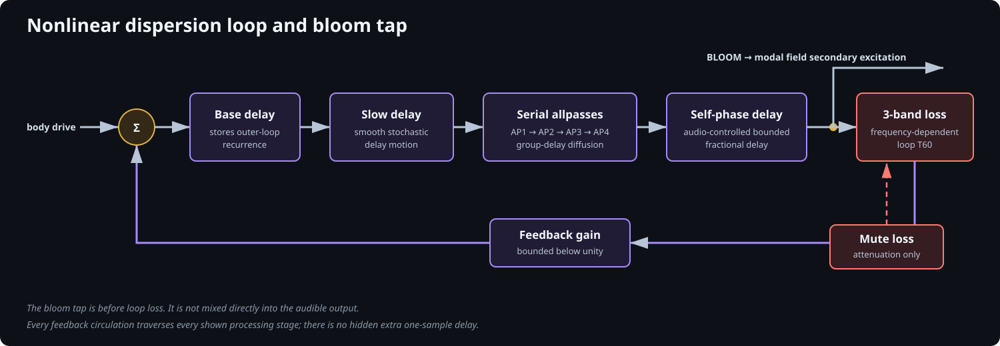

# TriggerFish nonlinear resonator architecture

This document describes TriggerFish's general nonlinear resonator architecture
and its current crash-cymbal profile. It is intended to stand alone: a reader
should not need the fitting notes or source code to understand the signal flow,
state, controls, and energy model.

The model is constructive and perceptual. It does not attempt a finite-element
simulation of a particular cymbal. Instead, it combines controllable contact,
nonlinear bloom, and modal-state primitives that can be fitted to recorded
cymbals while retaining useful musical controls.

The reusable architecture consists of contact excitation, nonlinear bloom, a
unified stochastic modal field, passive loss, and observation. Its first
concrete profile is designed and calibrated for cymbals; the current 24-anchor,
408-state allocation and bell/bow/edge projections are profile choices rather
than restrictions of the underlying components.

The unified cymbal body is still experimental. The workbench retains the
preceding three-branch body for A/B diagnosis, but that legacy path is not the
proposed instrument architecture.

## Design principles

- Contact, body development, resonant storage, loss, and observation are
  separate responsibilities.
- Every audible tail comes from explicit state. Noise is not pasted over the
  output to imitate density.
- A single modal representation spans identifiable ridges, overlapping modal
  packets, and noise-like metallic wash.
- Turbulence redistributes excitation or stored energy; it does not silently
  increase level or extend T60.
- Mute is passive: it can only increase loss.
- Location and velocity change how a strike couples to one shared object.
  They do not select unrelated cymbal recordings or bodies.
- The synthesis body is mono. Stereo, microphone perspective, and propagation
  belong to a later presentation stage.
- Production execution is a fixed series of compiled C++ calls with no runtime
  graph traversal or audio-thread allocation.

## Complete signal flow


There are two routes out of the contact model:

1. **Direct contact radiation** is the near-field tick, scrape, or impact heard
   before the body has developed.
2. **Body drive** excites both the modal field immediately and the dispersion
   loop. The loop's delayed output, called **bloom**, provides a second
   excitation port into the same modal field.

The dispersion signal is deliberately not audible by itself. Its job is to
turn a compact collision into a developing, correlated force that excites the
cymbal body. The final observation stage hears direct contact and the modal
body only.

At trigger time, the instrument calculates the contact gesture and the strike
projection. During each audio sample it then performs:

```text
contact = ContactExciter::Process()
bloom   = DispersionLoop::Process(contact.bodyDrive, bloomMuteLoss)
body    = StochasticModalField::ProcessExcitedPair(
              contact.bodyDrive, bloom, modalMuteLoss)
output  = ObservationModel::Process({contact.directRadiation, 0, body, 0})
```

The zero source slots belong to the disabled legacy sparse and turbulent
branches. They allow both architectures to use the same diagnostic frame and
observation component.

## 1. Contact excitation

One `ContactExciter` combines four short primitives:

| Primitive | Purpose |
| --- | --- |
| Finite half-sine force pulse | Coherent compression and release of a stick or mallet contact |
| Damped chirp | Concentrated hard-tip ping and bell articulation |
| Enveloped tilted noise | Continuous broadband collision component |
| Micro-contact burst | Dense, sub-perceptual small contacts for brushes and rough contact |

Each primitive has an independently fitted gain into the direct and body-drive
ports. A noise component used as body force therefore need not be heard as an
unrelated dry noise layer.

The implement coordinate is currently divided into three families: brush,
mallet, and stick. Within each family, hardness or character changes contact
duration, chirp contribution, noise bandwidth, and micro-contact statistics.
A brush has no coherent pulse or chirp in the present routing; its baseline
gesture is distributed even at minimum spread.

Velocity is more than an output multiplier. It changes:

- total contact amplitude through a fitted power law;
- pulse and chirp duration;
- noise and micro-contact energy;
- chirp frequency; and
- the high-frequency coupling of the body projection.

This lets a stronger strike become shorter, brighter, and more effective at
exciting fine structure. The direct-contact and modal-body amplitude laws may
differ, so their balance can evolve with velocity.

## 2. Nonlinear dispersion and bloom

The bloom generator is one serial processor enclosed by one explicit feedback
loop. The immediate design inspiration is Zion Jaymes's
[cymbal-synthesis walkthrough](https://www.youtube.com/watch?v=netcpYINyBQ),
which demonstrates a compact strike feeding feedback dispersion, serial
allpasses, phase distortion, and resonator stages. TriggerFish preserves that
perceptual decomposition while implementing its own bounded, causal DSP
components and one explicit wet-only loop:



Every circulation passes through every stage. The base and moving delays
provide real propagation, so this loop is causal without an additional hidden
one-sample delay or a zero-delay Newton solve.

The stages have distinct jobs:

- **Base fractional delay** establishes the shortest recurrence time.
- **Slow modulated delay** changes recurrence relationships gradually, even in
  a quiet tail, and prevents a static comb signature.
- **Four serial Schroeder allpasses** increase arrival density and distribute
  group delay without setting the modal body's T60.
- **Self-phase delay** makes instantaneous signed audio alter a bounded
  fractional-delay read. Strong circulating energy therefore creates
  correlated sidebands and a velocity-dependent bloom; the loop becomes more
  nearly linear as it decays.
- **Three-band decay filter and scalar feedback** make the loop contractive and
  give low, middle, and high frequencies different persistence.

Four perceptually separate controls expose the loop. `Bloom level` is a true
linear route from its return into the body and can reach silence.
`Bloom nonlinearity` sets self-phase excursion/drive without also changing that
route. `Bloom development` controls loop persistence, and `Bloom diffusion`
sets the serial-allpass contribution. Reducing diffusion therefore does not
remove the loop's propagation delay or turn bloom into direct sound.

Bloom is a force signal, not a second body and not an audible effect return. It
feeds the secondary excitation projection of the modal field. Consequently,
the early body response can remain localized while later energy becomes more
body-wide and diffuse.

## 3. Unified stochastic modal field

### Why there are 408 states

The editor provides 24 constructive modal anchors. Every anchor expands into a
packet of 17 complex two-pole modal states:

$$
24\,(1 + 8 + 8) = 408 \text{ modal states}.
$$

The number 17 is an engineering choice, not a physical claim about a cymbal.
It provides enough local density to test a continuous ridge-to-wash model with
a fixed, deterministic cost. Adaptive packet sizes are a possible later
optimization.


The centre is placed exactly at the painted frequency. Satellite offsets are
symmetric in ERB-rate space, with deterministic jitter and progressively
larger radius. ERB spacing is used because equal ERB distances correspond more
closely to comparable auditory bandwidth than equal hertz distances.

The translucent bell drawn by the editor is therefore a design metaphor for a
local stochastic neighbourhood. It is not a literal Gaussian distribution of
measured physical eigenmodes.

### One oscillator state

Each state stores a complex value $z_m=x_m+jy_m$. Ignoring excitation,
turbulence, and mute for a moment, one sample is:

$$
z_m[n+1] = r_m e^{j\omega_m}z_m[n],
\qquad
\omega_m = \frac{2\pi f_m}{f_s}.
$$

The pole radius is derived from the requested amplitude $T_{60,m}$:

$$
r_m = \exp\!\left(
  \frac{\ln(10^{-3})}{T_{60,m}f_s}
\right).
$$

The modal output is a weighted sum of the real components. Complex state makes
frequency, decay, input phase, and energy accounting explicit without needing
a feedback comb to obtain a pole.

### Turbulence is a coordinated trajectory

The global turbulence value is multiplied by each anchor's local turbulence
scaler:

$$
t_a = \operatorname{clamp}(t_{\mathrm{global}}s_a,\,0,\,1).
$$

That local value coordinates four related but separate mechanisms:

1. **Centre-to-satellite excitation distribution**
2. **Satellite frequency spread**
3. **Stochastic phase diffusion**
4. **Passive exchange between neighbouring states**

Keeping these mechanisms separately implemented is important: their advanced
scalers can be ablated and calibrated even though the normal interface presents
one perceptually meaningful trajectory.

#### Excitation-energy distribution

For local turbulence $t$, the current packet assigns:

$$
\begin{aligned}
E_d &= 0.9t^2,\\
w_c &= \sqrt{1-E_d},\\
w_s &= \sqrt{\frac{E_d}{16}}.
\end{aligned}
$$

Therefore:

$$
w_c^2 + 16w_s^2 = 1.
$$

This preserves the squared norm of the packet's excitation coefficients.
Increasing turbulence reallocates drive from the coherent centre into nearby
states instead of obtaining a louder body by duplication. Actual instantaneous
audio energy can still vary through phase interference and existing state.

At $t=0$, only the centre receives energy and the packet behaves as one clean
mode. As $t$ increases, the same anchor becomes a cluster and eventually a
dense local wash.

#### Frequency spread

Satellite offsets grow as:

$$
\Delta_{\mathrm{ERB,max}} = t\,\Delta_{\mathrm{ERB,control}}.
$$

Offsets are applied in ERB-rate space and converted back to hertz. This avoids
making low-frequency packets excessively wide or high-frequency packets
perceptually too narrow.

#### Phase diffusion

After the normal modal rotation, every active state may receive a randomly
signed unit-magnitude phase rotation. For requested linewidth $B$:

$$
c = e^{-\pi B/f_s},
\qquad
s = \sqrt{1-c^2},
\qquad
q\in\{-1,+1\},
$$

$$
\begin{bmatrix}x'_m\\y'_m\end{bmatrix}
=
\begin{bmatrix}c&-qs\\qs&c\end{bmatrix}
\begin{bmatrix}x_m\\y_m\end{bmatrix}.
$$

This is a rotation, so

$$
(x'_m)^2+(y'_m)^2=x_m^2+y_m^2.
$$

It broadens the expected
spectral ridge and breaks perfectly stationary sinusoidal ringing without
adding energy or changing the declared pole radius.

The bandwidth is derived from local ERB bandwidth and grows approximately as
$t^2$. The centre receives less diffusion than its satellites, which allows a
recognizable ridge to remain inside a noisy packet.

#### Neighbour energy exchange

After propagation, adjacent compatible states are mixed with a randomly signed
Givens rotation:

$$
\begin{bmatrix}z'_a\\z'_b\end{bmatrix}
=
\begin{bmatrix}
\cos\theta&-\sin\theta\\
\sin\theta& \cos\theta
\end{bmatrix}
\begin{bmatrix}z_a\\z_b\end{bmatrix}.
$$

The transform is orthogonal, hence:

$$
|z'_a|^2+|z'_b|^2=|z_a|^2+|z_b|^2.
$$

Pairing alternates between even and odd neighbours on successive samples.
Exchange is allowed within a packet and across immediately adjacent packet
boundaries. Its amount uses the geometric mean of the two local turbulence
amounts, so a deliberately clean packet is not randomized merely because its
neighbour is turbulent.

The rotation itself is lossless. Once energy moves to a state with a different
pole radius, its subsequent decay follows that recipient state; this is the
intended interaction between exchange and the fitted T60 curve.

### Direct and bloom excitation share the same state

Each mode has two excitation projections:

- the **primary projection** is recalculated for the current hit and carries
  location and velocity colour;
- the **secondary projection** is a fixed bow/body-wide projection used by
  delayed bloom.

Both write the same complex modal state. A retrigger therefore adds energy to
the ringing object rather than restarting an envelope or creating a parallel
voice. This is what permits repeated hits to accumulate and form a crash swell.

### Location

The current location model stores bell, bow, and edge excitation projections
over the shared 408 states. The hit coordinate interpolates linearly from bell
to bow and then bow to edge.

- Bell emphasizes a focused mid/high region.
- Bow uses a broadly distributed, mildly irregular projection.
- Edge progressively emphasizes higher-index structure.

Velocity adds a frequency-dependent tilt to the selected projection. These
curves are constructive heuristics and remain calibration targets; location
does not retune or replace the underlying modal object in the current model.

## 4. Decay, stored energy, and mute

All modal packets share one frequency-dependent T60 curve with between two and
eight active knots. Its horizontal coordinate is ERB rate and its vertical
coordinate is logarithmic seconds. The two boundary knots have fixed positions
at DC and the current Nyquist frequency but finite, editable T60 values; they
define extrapolation at the limits rather than fictitious DC or Nyquist modes.
Interior knots can be inserted, moved, or removed. The current interpolation is
piecewise linear in this transformed space. It is evaluated only when modal
parameters are prepared, so the audio loop still contains fixed pole
coefficients and no curve traversal. Each anchor also has a bounded decay ratio,
so a musically important ridge may live somewhat longer or shorter than the
surrounding curve without acquiring a completely independent envelope.

For diagnostic purposes, modal stored energy is:

$$
E[n]=\sum_{m\in\mathcal A}\left(x_m[n]^2+y_m[n]^2\right),
$$

where $\mathcal A$ is the set of active modal states.

The energy contract is:

- contact and bloom may inject energy;
- modal pole radii dissipate energy according to T60;
- phase diffusion preserves each state's instantaneous energy;
- Givens exchange preserves the paired instantaneous energy;
- mute only multiplies recurrence radii by values in $[0,1]$; and
- observation filters never feed the result back into synthesis state.

Mute drives two smoothed passive-loss controllers. One damps the dispersion
loop and the other damps modal recurrence, each with broadband and low/mid/high
gains. Stronger mute shortens both ongoing bloom and stored modal ringing. It
never triggers contact, adds noise, or injects a closing transient.

## 5. Observation and radiation

The observation stage receives explicit synthesis taps. In unified mode only
two are audible:

Direct contact passes through the direct observation path; the modal field
passes through the body observation path. The two paths meet only at the final
observation mix shown in the complete signal-flow diagram.

Each path supports static gain, polarity, an optional radiation filter, and an
optional relative delay for acoustic or microphone alignment. That delay is
outside the resonator state and is zero by default. The filter is:

```text
12 dB/oct high-pass -> peaking colour EQ -> 12 dB/oct low-pass
```

This stage describes how the synthesized object is heard. It does not alter
the modal frequencies, stored energy, or decay. The workbench normally exposes
only contact presence and simple contact/body bandwidth and colour controls;
filter Q and bypass controls remain available under advanced sections rather
than becoming inaccessible hidden constants.

The workbench's safety limiter and master volume follow this model output but
are presentation safeguards, not part of the fitted cymbal synthesis graph.

## Control map

| Musical or design control | Principal internal effect |
| --- | --- |
| Strength | Contact energy, contact duration and spectrum, body amplitude law, velocity colour |
| Location | Interpolation of bell/bow/edge primary modal projection; contact colour |
| Implement | Brush/mallet/stick contact primitive mix and routing |
| Hardness/character | Contact duration, chirp prominence/frequency, noise and micro-contact colour |
| Contact spread | Duration/density of distributed brush or rough-contact gesture |
| Bloom level | Dispersion-return level injected into the modal body |
| Bloom nonlinearity | Nonlinear dispersion excursion/drive |
| Bloom development | Dispersion-loop feedback and persistence |
| Bloom diffusion | Strength of serial allpass group-delay dispersion |
| Painted anchor frequency | Centre frequency of one modal packet |
| Painted anchor level | Relative excitation energy of that packet; minimum disables it |
| Global turbulence | Coordinated ridge-to-wash trajectory for every packet |
| Per-anchor turbulence | Local scaling of the global trajectory |
| Packet spread | Maximum satellite distribution in ERB space |
| Phase bandwidth | Maximum stochastic modal linewidth |
| Energy exchange | Maximum passive neighbouring-state rotation |
| Shared T60 curve | Frequency-dependent modal loss |
| Mute | Smoothed passive loss in both bloom and modal state |
| Radiation controls | Output observation colour only |

## What the unified field replaces

The legacy workbench body contains three parallel renderers:

1. a small arbitrary resolved modal bank;
2. a 2,048--4,096-state statistical modal cloud; and
3. a three-band noise-read turbulent energy reservoir.

Those branches could be balanced independently but overlapped conceptually.
They did not exchange energy with one another; they merely received related
excitation and were summed at observation.

The unified field deliberately replaces their overlapping jobs with one stored
representation. A painted anchor can remain a clean ridge, spread into a modal
cluster, or approach noise-like wash. Local orthogonal exchange supplies actual
passive interaction inside that representation.

This does not guarantee identical expressive coverage. In particular, 408
states have lower raw spectral occupancy than the largest legacy cloud, and
there is no separately tunable noise reservoir. The legacy view remains useful
for A/B tests until reference fitting demonstrates that the unified model
covers the required sounds. If a systematic residual remains, the first remedy
should be adaptive packet allocation or a clearer missing physical/perceptual
mechanism, rather than restoring several redundant output layers by default.

## Numerical and quality status

The implementation is deterministic for a given seed, allocation-free in its
audio loop, and guarded against non-finite state. Component and graph tests
cover modal frequency/T60, phase and exchange energy invariants, passive mute,
restrikes, block-size independence, multiple sample rates, and native/WebAssembly
agreement.

These tests establish numerical behaviour, not perceptual calibration. The
current unified field is a cleaner model hypothesis; it has not yet earned a
claim of equal or better sound quality than every legacy branch or reference
recording. Fits are accepted by reference comparison and listening, never by an
aggregate numerical score alone.

The fixed 408-state implementation is intentionally quality-first and is
currently more expensive than the legacy 2,048-state cloud because each state
has complex recurrence, stochastic phase work, and optional neighbour
exchange. SIMD layout, adaptive packet population, and lower control-rate
random/exchange updates are optimization candidates only after the topology is
perceptually validated.

## References and provenance

### Direct tutorial studies

- Zion Jaymes,
  [cymbal-synthesis walkthrough](https://www.youtube.com/watch?v=netcpYINyBQ).
  This is the direct inspiration for the strike-to-dispersion-to-resonator
  decomposition, the serial allpasses and signal-dependent phase stage inside
  feedback, the inaudible dispersion return, and separate direct contact.
- Zion Jaymes,
  [Synthesize SNARES that sound REAL using the power of FEEDBACK](https://www.youtube.com/watch?v=1Db9rGbth_o),
  and the [snare follow-up](https://www.youtube.com/watch?v=LxV5J6UpR8Y).
  These informed the reusable separation of contact, feedback body, loss, and
  observation, but do not define the current cymbal body.
- Zion Jaymes,
  [Synthesize Kick drums that sound REAL using the power of FM](https://www.youtube.com/watch?v=ndG-6-vONNc).
  This informed the general correlated-contact/FM primitives and close/far
  observation vocabulary, not the crash signal path.

These videos are perceptual sound-design studies, not claimed physical
derivations. TriggerFish does not reproduce their DAW graphs or plugin-specific
workarounds literally; it translates the useful structures into bounded,
testable, reusable DSP components.

### Modal and nonlinear-cymbal research

- Travis Skare and Jonathan Abel,
  [*Real-Time Modal Synthesis of Crash Cymbals with Nonlinear Approximations,
  using a GPU*](https://www.dafx.de/paper-archive/2019/DAFx2019_paper_48.pdf),
  DAFx-19. This supports complex high-Q modal recurrence, very dense cymbal
  mode sets, phase-preserving restrikes, and the need for energy-dependent
  extensions beyond a static linear bank. It also points to the Mathews--Smith
  phasor filter on which this form of modal recurrence is based.
- Gabriel Cirio, Ante Qu, George Drettakis, Eitan Grinspun, and Changxi Zheng,
  [*Multi-Scale Simulation of Nonlinear Thin-Shell Sound with Wave
  Turbulence*](https://www.cs.columbia.edu/cg/waveturb/), SIGGRAPH 2018.
  Its frequency-domain energy cascade motivates modelling the evolving
  ridge-to-wash transition and high-frequency diffusion. TriggerFish does not
  implement its nonlinear shell solver or phenomenological diffusion solver.
- Michele Ducceschi and Cyril Touzé,
  [*Modal approach for nonlinear vibrations of damped impacted plates:
  Application to sound synthesis of gongs and
  cymbals*](https://doi.org/10.1016/j.jsv.2015.01.029), 2015. This establishes
  the relevance of modal state, impact excitation, frequency-dependent loss,
  nonlinear coupling, and energy-aware integration for struck metal plates.
- Quoc Bao Nguyen and Cyril Touzé,
  [*Nonlinear vibrations of thin plates with variable thickness: Application
  to sound synthesis of
  cymbals*](https://doi.org/10.1121/1.5091013), 2019. Its treatment of cymbal
  taper and shape supports treating bell, bow, edge, and size as changes in
  modal coupling and structure rather than as a single global pitch shift.
- Dan Stowell,
  [*Cymbal synthesis tutorial*](https://mcld.co.uk/cymbalsynthesis/). This is
  an earlier constructive, real-time, spectrogram-guided cymbal design and a
  useful independent example of perceptual rather than exact physical
  synthesis.

The 17-state packet, normalized centre-to-satellite trajectory, random signed
phase rotation, and local Givens exchange are TriggerFish's constructive
integration of these requirements. They should be evaluated on their stated
energy invariants and perceptual results; they must not be described as the
algorithm from any one reference above.

## Deferred pitched playing

The workbench harmonic guide is a design aid only. It can place modal centres
on a chosen harmonic series, but it is not a runtime pitch input and does not
reset or retune sounding state.

A later melodic profile should expose pitch CV through an explicit keyboard
mapping rather than moving every component by the same ratio. A useful modal
starting point is

$$
f_m(p) = f_m(0)\,2^{\alpha_m p/12},
$$

where $p$ is the pitch offset in semitones and $\alpha_m$ is a per-mode or
frequency-dependent tracking amount. Separate, compact tracking curves can
then describe how decay, packet spread and turbulence, bloom timing and drive,
and radiation colour evolve across the keyboard. These mappings should be
smoothed without resetting stored modal energy. Their parameter set and event
semantics are deliberately deferred until the fixed-pitch instrument is fitted.

## Source map

| Responsibility | Source |
| --- | --- |
| Instrument composition and event mapping | `src/tfdsp/percussion/crash_cymbal.cpp` |
| Fit parameters and expansion into prepared DSP data | `src/tfdsp/percussion/crash_cymbal_parameters.cpp` |
| Contact routing | `src/tfdsp/percussion/contact_exciter.hpp` |
| Nonlinear feedback bloom | `src/tfdsp/percussion/dispersion_loop.hpp` |
| Unified modal recurrence, diffusion, and exchange | `src/tfdsp/percussion/stochastic_modal_field.hpp` |
| Passive live damping | `src/tfdsp/percussion/passive_constraint.hpp` and `modal_constraint.hpp` |
| Output presentation | `src/tfdsp/percussion/observation_model.hpp` and `radiation_filter.hpp` |

Related documents cover the reusable component specification, fitting policy,
analysis, and browser tooling:

- [Metallic percussion DSP components](TfPercussion-metal-components.md)
- [Crash fitting methodology](TfCrash-fitting-methodology.md)
- [Percussion analysis toolkit](TfPercussion-analysis-toolkit.md)
- [Percussion ear-fitting workbench](TfPercussion-ear-fitting-workbench.md)
