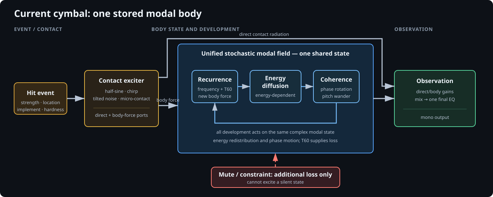
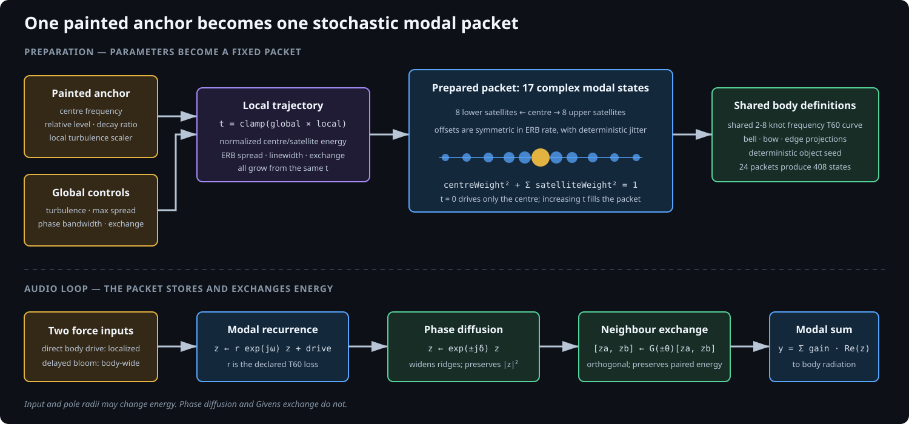

# TriggerFish nonlinear modal resonator architecture

This document describes the current constructive cymbal body. It is a mono,
stateful instrument made from contact excitation, one unified stochastic modal
field, passive loss, and observation filtering. It is not a finite-element
model and it does not claim that each control is a measurable physical property.
Its controls are intended to be audible, reasonably orthogonal, and fit-able to
recordings.

The defining design choice is that attack ridges, dense wash, and nonlinear
bloom are different behaviours of one modal state. There is no delayed bloom
sample, hidden latch, separately audible noise tail, or second resonator bank in
the active cymbal recipe.

## Active signal flow



```text
hit event
   |
   v
contact exciter -----------------------> direct radiation --+
   |                                                        |
   `---- body force ---> unified stochastic modal field ----+--> mono output
                              |       |       |
                              |       |       `-- local passive exchange
                              |       `---------- phase diffusion
                              `------------------ upward energy cascade

mute/constraint ----------------------> additional modal loss only
```

One hit computes a new excitation projection and starts a contact gesture. Each
sample then executes, in this order:

```text
contact = ContactExciter::Process()
body = StochasticModalField::ProcessExcitedPair(contact.bodyDrive, 0, muteLoss)
output = ObservationModel::Process({contact.directRadiation, body})
```

Inside the modal field, recurrence happens before the upward cascade and local
exchange. The entire audio loop is fixed C++; it performs no graph traversal,
allocation, or JSON processing.

## Contact excitation

`ContactExciter` combines four finite gestures:

| Primitive | Perceptual role |
| --- | --- |
| Half-sine force | coherent compression and release |
| Damped chirp | hard-tip ping or bell articulation |
| Enveloped tilted noise | broadband collision |
| Dense micro-contact burst | brushes and rough contact |

It exposes a direct-radiation port and a body-force port. A noisy force can
therefore excite resonances without necessarily appearing as an unrelated dry
noise layer. Brush, mallet, and stick are families on one performance control;
their character control changes bristle stiffness, mallet firmness, or tip
hardness respectively.

Strike strength is not compressed by a hidden velocity curve. It scales the
incident force linearly and also changes physically plausible contact
properties: duration, chirp frequency, micro-contact contribution, and noise
bandwidth. A visible `Velocity brightness` control changes the high-frequency
modal coupling of new force. It never recolours energy already ringing.

## One body, represented by modal packets



The editor contains 24 anchors. Each anchor has:

- a centre frequency;
- a relative excitation level; and
- a local multiplier for the global turbulence field.

At preparation time an anchor expands to one coherent centre state and sixteen
deterministic stochastic satellites. The current cymbal therefore has 408
complex modal states. This is a quality-first capacity choice, not part of the
public architecture.

For mode $m$, before cross-mode processing, the recurrence is

$$
z_m[n+1] = r_m e^{j\omega_m[n]}z_m[n] + g_m x[n],
$$

where $r_m$ comes from the shared T60 curve, $g_m$ contains the painted level
and current strike projection, and $\omega_m[n]$ may contain a small stochastic
phase perturbation. With no drive or constraint, the pole radius is the only
loss in this recurrence.

Global turbulence and its per-anchor multiplier control a normalized
centre-to-satellite trajectory. Increasing turbulence:

1. transfers excitation weight from the centre to its satellites;
2. widens their spread on the ERB-rate axis;
3. increases magnitude-preserving phase diffusion; and
4. increases passive exchange with compatible neighbours.

The squared excitation weights are normalized, so turbulence is not an
unlabelled gain control. A frequency-dependent turbulence field is

$$
t(f)=\operatorname{clamp}\!\left(
  t_c+s\log_2\!\frac{f}{f_c},\;0,\;1
\right)t_{\mathrm{local}},
$$

where $t_c$ is `Turbulence`, $s$ is `Turbulence slope`, and $f_c$ is
`Turbulence centre`. Positive slope keeps low packets more defined while making
high packets progressively wash-like. This is deliberately independent of the
painted body-energy tilt.

## Intrinsic bloom: stored-energy transport

Bloom is a passive, one-way cascade between frequency-ordered packets. It acts
directly on their complex states. For adjacent lower and upper packets with
stored energies $E_l$ and $E_u$, one sample computes a bounded transfer fraction

$$
q = 1-\exp\!\left(-\frac{R\,a(E_l)}{F_s\,\Delta o}\right),
$$

where $R$ is `Bloom rate` in octaves per second, $\Delta o$ is the octave gap,
and $F_s$ is sample rate. `Bloom energy dependence` controls

$$
a(E_l)=1+d\left(\frac{E_l}{E_l+E_{\mathrm{ref}}}-1\right).
$$

At $d=0$, transport rate is level-independent. At $d>0$, a higher-energy
strike moves energy upward faster. This is in addition to, and testable
separately from, the visible velocity-brightness excitation tilt.
With the factory mapping, every increase in strike strength therefore both
injects more total energy and increases high-frequency excitation; it cannot
become darker merely because the input became stronger.

The state update is

$$
E_l'=(1-q)E_l, \qquad E_u'=E_u+qE_l.
$$

It is implemented by magnitude scaling of the actual complex packet states, so
apart from floating-point error,

$$
E_l'+E_u'=E_l+E_u.
$$

No signal is added to the output. If the upper packet was silent it is seeded
with exactly the transferred energy; otherwise its existing state is scaled.
`Bloom phase diffusion` then rotates destination phasors by deterministic
signed angles. Rotation changes correlation and texture but preserves
magnitude.

Adjacent pairs are processed from highest to lowest frequency. Newly received
energy therefore cannot cross a second packet boundary in the same sample. The
bloom is continuous from the beginning of a strike and progresses upward at a
declared rate; it cannot suddenly appear after an arbitrary timer. Repeated
hits add force to the state already present, so a crash can build and swell.

This mechanism is a constructive approximation to nonlinear energy transfer,
not a solver for thin-shell equations. It intentionally models the perceptual
property the control names: low-frequency stored energy progressively populates
higher, denser modal regions.

## Local diffusion and exchange

Two separate energy-neutral processes control density:

- phase diffusion rotates individual complex modal states;
- local exchange applies signed Givens rotations to neighbouring state pairs.

For two real state components,

$$
\begin{bmatrix}x_a'\\x_b'\end{bmatrix}=
\begin{bmatrix}\cos\theta&-\sin\theta\\
                \sin\theta& \cos\theta\end{bmatrix}
\begin{bmatrix}x_a\\x_b\end{bmatrix}.
$$

The same rotation is applied to the imaginary components, so paired energy is
unchanged. Unlike the upward cascade, local exchange is symmetric and does not
create a preferred spectral direction.

These operations have distinct jobs:

| Control | Changes |
| --- | --- |
| Packet spread | prepared satellite frequencies |
| Phase bandwidth | time-varying coherence/linewidth |
| Local exchange | passive short-range state mixing |
| Bloom rate | directed upward state-energy travel |
| Bloom energy dependence | how strongly travel accelerates with strike energy |
| Bloom phase diffusion | correlation of newly populated upper states |

## Decay and mute

All modes use one shared frequency-dependent T60 curve. The ordinary curve has
only two active boundary values, at DC and Nyquist. Up to six interior knots
are available for sparse last-stage correction, but fitting may not use them to
hide errors in excitation, modal placement, turbulence, or bloom.

T60 is interpolated in ERB rate and log seconds. It supplies each mode's pole
radius

$$
r_m = 10^{-3/(F_s T_{60}(f_m))}.
$$

Bloom and exchange do not define another hidden low/mid/high decay system.
Moving energy upward can change the observed envelope because the destination
modes use the T60 appropriate to their frequencies; that is the intended
interaction between spectral transport and loss.

Mute is a smoothed multiplicative loss applied to the modal recurrence. It can
only remove energy. A change of mute on a silent body remains silent, and a slow
constraint movement injects no energy.

## Constructive colour controls

`Body energy tilt` is a coarse tilt of painted modal excitation levels around
the visible `Body tilt centre`. It is convenient for broad matching while the
painted levels retain local control. Its range is deliberately wide enough to
move from low-dominated gong starts to bright cymbal starts.

`Body excitation` is the explicit gain between the contact body port and this
modal field. It changes stored energy and therefore the operating point of the
energy-dependent cascade. `Body observation level` is downstream and changes
only the audible readout. There is no independent hidden graph-edge gain.

The turbulence level/slope/centre controls describe coherence and density, not
spectral amplitude. Body tune scales modal centre frequencies, while contact
chirp pitch changes only the impact. Neither is a global audio-domain pitch
shifter.

The final observation has independent direct and body gains and static
radiation filters. Observation filtering changes recorded colour without
changing the body's stored energy or T60. An optional relative propagation
delay exists for future presentation work and is off by default. Stereo remains
an output-presentation extension; the synthesized object is mono.

## Explicit non-features

The active metallic recipe does not contain:

- a dispersion-loop node or delayed secondary body input;
- a separately audible turbulent-noise reservoir;
- independent resolved and dense modal banks;
- trigger-relative bloom latches, timers, or envelopes;
- hidden connection gains; or
- per-mode fitted decay multipliers.

The tested allpass/self-phase `DispersionLoop` remains a reusable library
component for other recipes and experiments. It is not part of the current
cymbal renderer and must not be presented as its bloom mechanism.

## Verification contract

Automated tests establish structural properties, not perceptual calibration.
They cover:

- deterministic rendering and finite state at supported sample rates;
- monotonic output energy across a velocity sweep;
- increased high-frequency response for stronger strikes;
- stronger energy-dependent upward transport with velocity brightness disabled;
- exact passivity of an isolated cascade within tolerance;
- at most one packet boundary crossed per sample;
- energy-preserving phase diffusion and Givens exchange;
- passive mute and zero-strength no-op;
- additive restrikes when nonlinear transport is disabled; and
- bounded long rendering at maximum bloom settings.

Reference spectrograms and listening remain necessary to choose rates,
turbulence, modal placement, decay, and observation settings.

## References and provenance

- Zion Jaymes,
  [cymbal-synthesis walkthrough](https://www.youtube.com/watch?v=netcpYINyBQ).
  This motivated separating contact, developing metallic texture, resonators,
  and observation. The current state cascade is a revision, not a literal copy
  of the tutorial's feedback/allpass graph.
- Travis Skare and Jonathan Abel,
  [*Real-Time Modal Synthesis of Crash Cymbals with Nonlinear Approximations,
  using a GPU*](https://www.dafx.de/paper-archive/2019/DAFx2019_paper_48.pdf),
  DAFx-19. This supports dense complex modal recurrence, persistent state, and
  energy-dependent extensions to a static bank.
- Gabriel Cirio, Ante Qu, George Drettakis, Eitan Grinspun, and Changxi Zheng,
  [*Multi-Scale Simulation of Nonlinear Thin-Shell Sound with Wave
  Turbulence*](https://www.cs.columbia.edu/cg/waveturb/), SIGGRAPH 2018. Its
  frequency-domain energy cascade motivates directed spectral-energy transport.
  TriggerFish does not implement its shell or diffusion solvers.
- Michele Ducceschi and Cyril Touzé,
  [*Modal approach for nonlinear vibrations of damped impacted plates:
  Application to sound synthesis of gongs and
  cymbals*](https://doi.org/10.1016/j.jsv.2015.01.029), 2015. This establishes
  the relevance of modal state, impact excitation, frequency-dependent loss,
  and nonlinear coupling for struck plates.
- Quoc Bao Nguyen and Cyril Touzé,
  [*Nonlinear vibrations of thin plates with variable thickness: Application
  to sound synthesis of
  cymbals*](https://doi.org/10.1121/1.5091013), 2019. This supports treating
  profile and strike region as modal-coupling changes rather than one pitch
  control.
- Dan Stowell,
  [*Cymbal synthesis tutorial*](https://mcld.co.uk/cymbalsynthesis/), an
  independent real-time, spectrogram-guided constructive approach.

The 17-state packet, normalized centre/satellite trajectory, state-level upward
cascade, stochastic phase rotation, and local Givens exchange are TriggerFish
designs assembled from these requirements. They are evaluated by their declared
invariants and listening results, not attributed to any single source.

## Source map

| Responsibility | Source |
| --- | --- |
| Instrument/event composition | `src/tfdsp/percussion/crash_cymbal.cpp` |
| Fit expansion and strike projections | `src/tfdsp/percussion/crash_cymbal_parameters.cpp` |
| Contact gesture | `src/tfdsp/percussion/contact_exciter.hpp` |
| Unified recurrence and local exchange | `src/tfdsp/percussion/stochastic_modal_field.hpp` |
| Directed state-energy transport | `src/tfdsp/percussion/modal_energy_cascade.hpp` |
| Passive live damping | `src/tfdsp/percussion/passive_constraint.hpp` |
| Observation | `src/tfdsp/percussion/observation_model.hpp` |

Related documents:

- [Metallic percussion DSP components](TfPercussion-metal-components.md)
- [Crash fitting methodology](TfCrash-fitting-methodology.md)
- [Percussion analysis toolkit](TfPercussion-analysis-toolkit.md)
- [Percussion ear-fitting workbench](TfPercussion-ear-fitting-workbench.md)
